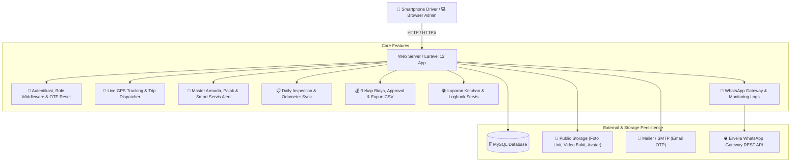

<p align="center">
  
</p>

<h1 align="center">🚛 Fleet Management System (Sistem Manajemen Armada)</h1>

<p align="center">
  <strong>Platform Terintegrasi Manajemen Operasional, Pelacakan GPS Real-Time, Pemeliharaan Kendaraan, dan Efisiensi Logistik Berbasis Laravel 12</strong>
</p>

<p align="center">
  <a href="https://laravel.com"></a>
  <a href="https://php.net"></a>
  <a href="https://getbootstrap.com"></a>
  <a href="https://leafletjs.com"></a>
  <a href="https://mysql.com"></a>
  <a href="https://api.ervelia.com"></a>
</p>

---

## 🌟 Tentang Proyek

**Fleet Management System** adalah aplikasi web komprehensif untuk mengelola seluruh siklus operasional kendaraan perusahaan, mulai dari pemantauan aset, pelacakan rute pengiriman real-time, inspeksi harian kelaikan jalan, penanganan keluhan kerusakan, hingga rekapitulasi keuangan, notifikasi otomatis WhatsApp Gateway, dan jadwal servis berkala otomatis.

Sistem ini didesain responsif untuk memudahkan pengemudi (*driver*) mengakses lewat *smartphone*, teknisi bengkel di lapangan, serta tim manajemen dan admin di kantor pusat.

---

## ✨ Fitur-Fitur Unggulan

### 📍 1. Pelacakan GPS Real-Time & Trip Dispatcher
- **Interactive Map (Leaflet.js):** Pemantauan posisi seluruh unit armada di peta interaktif dengan marker dinamis berdasarkan tipe kendaraan dan status kesiapan.
- **Trip Dispatcher & Telemetri Rute:** Penugasan rute perjalanan baru (`lokasi_asal`, `lokasi_tujuan`, koordinat tujuan, estimasi kecepatan) dengan perhitungan otomatis sisa jarak darat (*km*) dan estimasi waktu tiba (*ETA*).
- **Tombol Selesaikan Pengantaran (*Complete Delivery*):** Memindahkan posisi armada langsung ke titik tujuan drop-off dan memperbarui status perjalanan menjadi `Selesai Mengantar`.
- **Live GPS Update:** Sinkronisasi koordinat GPS instan langsung dari sensor GPS *smartphone* atau browser pengemudi.

### 🔔 2. Smart Maintenance Alert (Servis & Dokumen)
- **Deteksi Otomatis Servis Berkala:** Peringatan otomatis servis berkala berdasarkan jarak tempuh (kelipatan 5.000 KM) dan waktu (interval 3 bulan atau H-7).
- **Pemantauan Pajak & KIR:** Indikator visual jatuh tempo Pajak Tahunan, Pajak 5 Tahunan (Ganti Plat), dan Uji KIR Kendaraan (🟢 Aman, 🟡 Waspada $\le 30$ hari, 🔴 Jatuh Tempo).

### 📋 3. Pemeriksaan Harian (Daily Inspection Checklist)
- **6 Parameter Kelaikan Fisik:** Pengecekan Oli Mesin, Air Radiator, Minyak Rem, Ban & Rem, Lampu & Klakson, serta Kebersihan Unit.
- **Sinkronisasi Odometer Otomatis:** Angka odometer yang diinput pada formulir checklist harian secara otomatis menyinkronkan data odometer master armada.

### 🛠️ 4. Manajemen Keluhan & Siklus Perbaikan (Complaint Flow)
- **Pelaporan Kendala oleh Driver:** Driver dapat mengirim laporan keluhan kerusakan yang dilengkapi dengan bukti foto dan video.
- **Tracking Progress Teknisi:** Teknisi dapat memperbarui persentase *progress* perbaikan (0% - 100%).
- **Integrasi Otomatis:** Saat status keluhan diubah menjadi `Selesai`, sistem secara otomatis mencatat pengeluaran bengkel di rekap biaya dan memasukkan log ke *timeline* riwayat servis kendaraan.

### 💰 5. Rekap Biaya Operasional, Ekspor CSV & Quick BBM
- **Kategori Biaya Lengkap:** Pencatatan BBM, Tol, Bengkel/Servis, Parkir, Pajak, Sparepart, dan Biaya Lainnya.
- **Ekspor Laporan CSV:** Unduhan laporan pengeluaran siap pakai yang kompatibel dengan Microsoft Excel (menggunakan *UTF-8 BOM*).
- **Modal Quick BBM:** Pencatatan cepat pengisian bahan bakar (liter BBM + nominal) yang langsung memperbarui angka odometer kendaraan.
- **Otorisasi Anggaran Berjenjang:** Pengeluaran berbiaya besar di atas Rp 1.000.000 otomatis berstatus `Menunggu Persetujuan` dan membutuhkan approval dari Pimpinan/Admin.

### 🪪 6. Manajemen Pengemudi & Lisensi SIM
- **Penugasan Akun Driver:** Relasi langsung `driver_id` ke armada kendaraan.
- **Pendataan Lisensi SIM:** Nomor kontak telepon, nomor SIM, golongan SIM (SIM A, SIM B1, SIM B2, SIM C, Lainnya), dan batas akhir masa berlaku SIM.

### 🔐 7. Keamanan Akun & Pemulihan Sandi OTP
- **Rate Limiting Login:** Pembatasan otomatis maksimal 5 percobaan gagal per 60 detik untuk mencegah serangan *brute force*.
- **Pemulihan Kata Sandi 6-Digit OTP:** Pengguna dapat meminta kode OTP 6 digit via email notification yang berlaku selama 15 menit.

### 🌐 8. Multi-Role RBAC & Localization
- **3 Tingkatan Hak Akses Utama:** `Admin` (Manajemen & Fleet Control), `Teknisi` (Bengkel & Perawatan), dan `User` (Driver / Pengemudi).
- **Dukungan Dwibahasa:** Bahasa Indonesia (`id`) & Bahasa Inggris (`en`).

### 📲 9. Integrasi Notifikasi Otomatis WhatsApp Gateway API
- **Ervelia Gateway REST API:** Pengiriman notifikasi WhatsApp berbasis event secara instan dan tanpa jeda.
- **Event Notifikasi Otomatis:**
  - 🚨 **Keluhan Baru:** Laporan kerusakan armada langsung diteruskan ke WhatsApp Admin & Teknisi.
  - 🔄 **Update Progres Servis:** Status pengerjaan & penyelesaian unit diinfokan otomatis ke WhatsApp Driver pelapor.
  - ⚠️ **Checklist Peringatan:** Hasil inspeksi checklist harian yang bermasalah (Not OK) otomatis dilaporkan ke WhatsApp Admin.
  - 💼 **Approval Biaya Besar:** Notifikasi pengajuan anggaran perbaikan > Rp 1.000.000 ke WhatsApp Pimpinan.
  - 🚗 **Penugasan Rute & Driver:** Pengiriman instruksi dan rute pengantaran ke WhatsApp Driver.
- **Dashboard & Logbook WA:** Monitoring status pengiriman (`pending`, `success`, `failed`), respons JSON provider, dan tombol *Kirim Ulang (Resend)*.

---

## 🏗️ Arsitektur Sistem



---

## 🚀 Panduan Instalasi & Menjalankan Sistem

### 1. Kebutuhan Sistem (*Prerequisites*)
- PHP $\ge$ 8.2 (dengan ekstensi `pdo_mysql`, `mbstring`, `fileinfo`, `gd`/`imagick`, `curl`)
- MySQL / MariaDB $\ge$ 8.0 (atau XAMPP / Laragon aktif)
- Composer $\ge$ 2.x
- Git

### 2. Langkah Instalasi

```bash
# 1. Clone repositori
git clone https://github.com/stinrhmwti/belajar_laravel.git
cd belajar_laravel

# 2. Install dependensi composer
composer install

# 3. Buat berkas environment (.env)
copy .env.example .env

# 4. Generate Application Key
php artisan key:generate

# 5. Konfigurasikan database & WhatsApp Gateway di file .env, lalu jalankan migrasi & seeder
php artisan migrate --seed

# 6. Buat link symbolic storage publik untuk media upload
php artisan storage:link

# 7. Jalankan web server lokal
php artisan serve
```
Akses di browser: `http://127.0.0.1:8000`

### 3. Konfigurasi WhatsApp Gateway API (`.env`)
```env
# ============ PENGATURAN WHATSAPP GATEWAY ============
WHATSAPP_ENABLED=true
WHATSAPP_DRIVER=ervelia
WHATSAPP_BASE_URL=https://api.ervelia.com
WHATSAPP_TOKEN=token_api_gateway_anda_disini
WHATSAPP_COUNTRY_CODE=62
WHATSAPP_ADMIN_NUMBER=6281234567890
```

### 4. Menjalankan untuk Akses Handphone / Jaringan Wi-Fi
Tersedia skrip instan `jalankan_di_hp.bat` di folder utama. Cukup klik ganda file tersebut untuk otomatis mendeteksi IP PC lokal dan menyalakan server dengan host `0.0.0.0:8000`.

---

## 👥 Akun Demo Pengujian (Password: `password`)

| Peran (Role) | Username | Email | Hak Akses Utama |
| :--- | :--- | :--- | :--- |
| **Admin** | `admin_fleet` | `admin@fleet.com` | Kontrol penuh master armada, user & SIM, trip dispatcher, approval pengeluaran, WhatsApp Gateway monitor |
| **Teknisi** | `teknisi_utama` | `teknisi@fleet.com` | Penanganan keluhan, update progress perbaikan, ubah status servis, input checklist harian |
| **User (Driver)** | `driver_utama` | `user@fleet.com` | Lapor kerusakan foto/video, inspeksi checklist harian & sinkronisasi odometer, pelacakan armada saya, notifikasi WA |

---

## 📂 Dokumentasi Lengkap

Dokumentasi arsitektur mendalam, kamus data skema tabel database, matriks RBAC lengkap, serta tabel seluruh endpoint rute HTTP dapat dipelajari di:
👉 **[doc/belajar_sistem_armada.md](doc/belajar_sistem_armada.md)**

---

## 📄 Lisensi

Proyek ini dirilis di bawah lisensi [MIT License](LICENSE).
