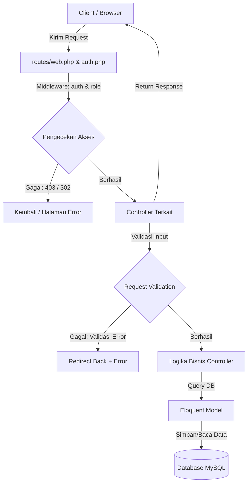
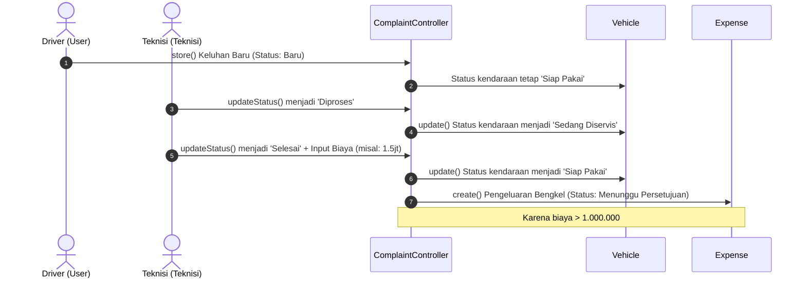
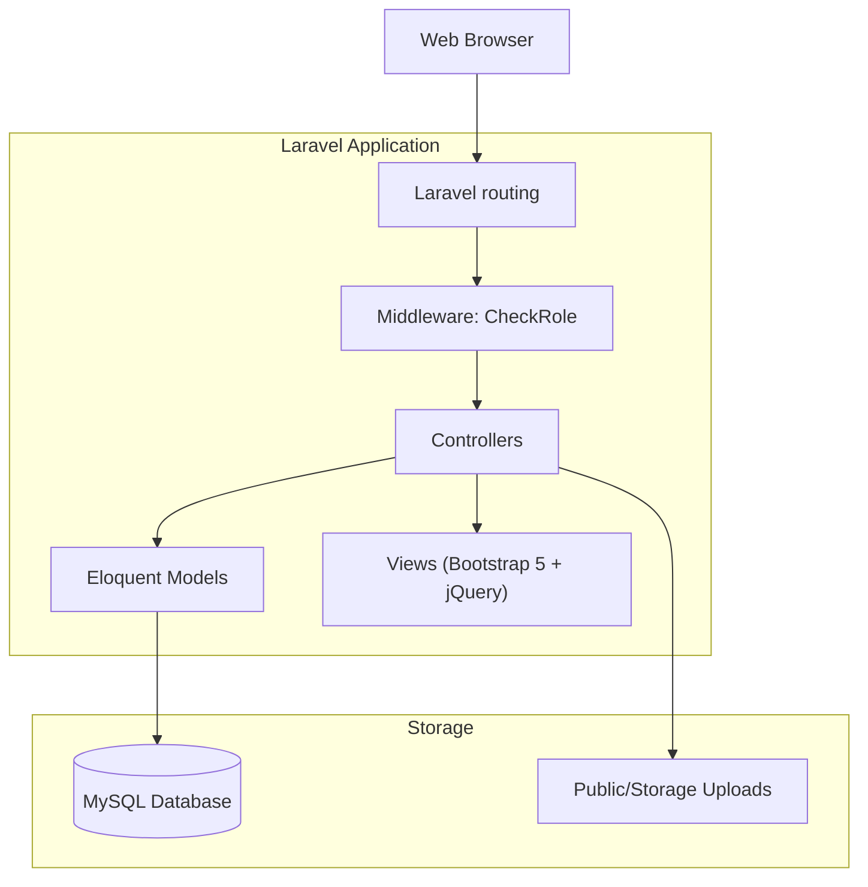
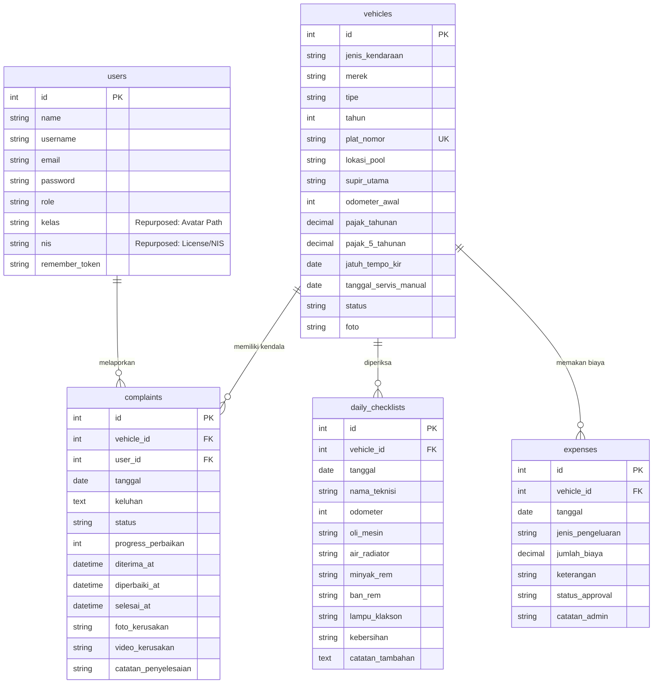

# Analisis Lengkap Sistem - Fleet Management System

Dokumen ini menyajikan analisis mendalam dari kode sumber (*source code*) aplikasi manajemen armada (*Fleet Management System*). Analisis ini didasarkan sepenuhnya pada implementasi nyata di dalam kode tanpa asumsi.

---

## DAFTAR MODUL UTAMA

### 1. Module: Autentikasi (Authentication)
*   **Tujuan Module:** Mengatur hak akses masuk (*login*) dan keluar (*logout*) pengguna ke dalam sistem, memverifikasi identitas, serta meregenerasi session untuk mencegah session fixation.
*   **Alur Bisnis:**
    1. Pengguna mengakses form login.
    2. Input email atau username divalidasi dan diidentifikasi secara otomatis.
    3. Percobaan autentikasi dilakukan menggunakan `Auth::attempt`. Jika berhasil, session diregenerasi dan diarahkan ke halaman yang dituju (*intended dashboard*).
    4. Pengguna dapat melakukan logout yang membatalkan session dan meregenerasi token CSRF.
*   **Route yang Digunakan:**
    *   `GET /login` (Name: `login`) - Menampilkan Form Login (`guest`)
    *   `POST /login` - Memproses data login (`guest`)
    *   `POST /logout` (Name: `logout`) - Mengakhiri session (`auth`)
*   **Controller yang Menangani:** [AuthController](file:///c:/xampppp/htdocs/belajar-laravel/app/Http/Controllers/AuthController.php)
*   **Request Validation:**
    *   `login` (Wajib, String) - Email atau Username.
    *   `password` (Wajib, String).
*   **Service yang Dipanggil:** `Auth` facade, `Session` facade.
*   **Repository atau Model yang Digunakan:** [User](file:///c:/xampppp/htdocs/belajar-laravel/app/Models/User.php)
*   **Tabel Database yang Diakses:** `users`
*   **Relasi antar Tabel:** Tidak menggunakan relasi tabel pada saat login.
*   **Response yang Dikembalikan:**
    *   Redirect ke Dashboard (`redirect()->intended(route('dashboard'))`) jika sukses.
    *   Redirect back dengan error validation jika gagal.
    *   Redirect ke form login jika logout sukses.

---

### 2. Module: Dashboard
*   **Tujuan Module:** Menyajikan pusat informasi operasional secara visual, statistik biaya, status kendaraan, kalender KIR/Servis, leaderboard teknisi, dan aksi cepat berdasarkan peran masing-masing user.
*   **Alur Bisnis:**
    1. Pengguna mengakses `/dashboard` setelah terautentikasi.
    2. Controller mendeteksi peran (`role`) user:
        *   **Admin/Superadmin/Pimpinan:** Menampilkan pengeluaran yang menunggu persetujuan, keluhan baru, chart boros kendaraan, dan tren biaya 6 bulan terakhir.
        *   **Teknisi:** Menampilkan keluhan yang perlu segera ditangani dan jumlah checklist hari ini.
        *   **Driver/User:** Menampilkan daftar armada miliknya, daftar keluhan pribadi, dan status siap pakai.
*   **Route yang Digunakan:** `GET /dashboard` (Name: `dashboard`)
*   **Controller yang Menangani:** [DashboardController](file:///c:/xampppp/htdocs/belajar-laravel/app/Http/Controllers/DashboardController.php)
*   **Request Validation:** Tidak ada request validation (hanya menampilkan visualisasi data).
*   **Service yang Dipanggil:** Database Query Builder, Carbon helper.
*   **Repository atau Model yang Digunakan:** [Vehicle](file:///c:/xampppp/htdocs/belajar-laravel/app/Models/Vehicle.php), [Complaint](file:///c:/xampppp/htdocs/belajar-laravel/app/Models/Complaint.php), [DailyChecklist](file:///c:/xampppp/htdocs/belajar-laravel/app/Models/DailyChecklist.php), [Expense](file:///c:/xampppp/htdocs/belajar-laravel/app/Models/Expense.php), [User](file:///c:/xampppp/htdocs/belajar-laravel/app/Models/User.php)
*   **Tabel Database yang Diakses:** `vehicles`, `complaints`, `daily_checklists`, `expenses`
*   **Relasi antar Tabel:**
    *   `Vehicle` hasMany `checklists`
    *   `Vehicle` hasMany `expenses`
    *   `Complaint` belongsTo `Vehicle`, belongsTo `User`
*   **Response yang Dikembalikan:** View `dashboard` dengan data array statistika operasional.

---

### 3. Module: Data Master Kendaraan (Vehicles)
*   **Tujuan Module:** Mengelola seluruh data aset kendaraan armada (tambah, edit, detail, hapus, status servis, status KIR, status pajak).
*   **Alur Bisnis:**
    1. **Admin** dapat menginput data kendaraan baru beserta kelengkapan surat, odometer awal, dan foto.
    2. Sistem secara otomatis menghitung status KIR (hijau/kuning/merah), sisa KM menuju servis berikutnya (kelipatan 5000 KM), dan tanggal servis berkala selanjutnya (3 bulan dari servis terakhir).
    3. **Admin/Teknisi** dapat memperbarui status operasional kendaraan (`Siap Pakai`, `Sedang Diservis`, `Selesai`) lewat rute cepat `/vehicles/{vehicle}/status`.
*   **Route yang Digunakan:**
    *   `GET /vehicles` (Name: `vehicles.index`)
    *   `GET /vehicles/{vehicle}` (Name: `vehicles.show`)
    *   `GET /vehicles-create` (Name: `vehicles.create`)
    *   `POST /vehicles` (Name: `vehicles.store`)
    *   `GET /vehicles/{vehicle}/edit` (Name: `vehicles.edit`)
    *   `PUT /vehicles/{vehicle}` (Name: `vehicles.update`)
    *   `DELETE /vehicles/{vehicle}` (Name: `vehicles.destroy`)
    *   `PUT /vehicles/{vehicle}/status` (Name: `vehicles.updateStatus`)
    *   `GET /vehicles/{vehicle}/read-notification` (Name: `vehicles.readNotification`)
*   **Controller yang Menangani:** [VehicleController](file:///c:/xampppp/htdocs/belajar-laravel/app/Http/Controllers/VehicleController.php)
*   **Request Validation:**
    *   `jenis_kendaraan`, `merek`, `tipe` (Wajib, String, max:255)
    *   `tahun` (Wajib, Integer, min:1900, max: tahun saat ini + 1)
    *   `plat_nomor` (Wajib, unique pada tabel `vehicles`)
    *   `odometer_awal` (Wajib, Integer, min:0)
    *   `foto` (Opsional, Image, mimes: jpeg,png,jpg,gif, max: 2048 KB)
*   **Service yang Dipanggil:** `Storage` facade (disk `public`) untuk kelola berkas foto.
*   **Repository atau Model yang Digunakan:** [Vehicle](file:///c:/xampppp/htdocs/belajar-laravel/app/Models/Vehicle.php)
*   **Tabel Database yang Diakses:** `vehicles`
*   **Relasi antar Tabel:**
    *   `Vehicle` hasMany `DailyChecklist`
    *   `Vehicle` hasMany `Expense`
*   **Response yang Dikembalikan:**
    *   View: `vehicles.index`, `vehicles.show`, `vehicles.create`, `vehicles.edit`.
    *   Redirect back atau redirect ke index dengan message `success`.

---

### 4. Module: Pemeriksaan Harian (Daily Checklist)
*   **Tujuan Module:** Mengontrol kelayakan operasional kendaraan sehari-hari melalui checklist kondisi fisik yang diisi oleh Teknisi/Admin.
*   **Alur Bisnis:**
    1. Teknisi memeriksa kendaraan fisik, lalu mengisi status parameter (`OK` atau `Not OK`).
    2. Angka odometer terkini yang dimasukkan pada checklist akan otomatis memperbarui kolom `odometer_awal` di tabel `vehicles` sebagai basis data terkini.
*   **Route yang Digunakan:**
    *   `GET /checklist` (Name: `checklist.index`)
    *   `GET /checklist-create` (Name: `checklist.create`)
    *   `POST /checklist` (Name: `checklist.store`)
    *   `GET /checklist/{checklist}` (Name: `checklist.show`)
    *   `DELETE /checklist/{checklist}` (Name: `checklist.destroy`)
*   **Controller yang Menangani:** [DailyChecklistController](file:///c:/xampppp/htdocs/belajar-laravel/app/Http/Controllers/DailyChecklistController.php)
*   **Request Validation:**
    *   `vehicle_id` (Wajib, exists di `vehicles.id`)
    *   `tanggal` (Wajib, Date)
    *   `nama_teknisi` (Wajib, String, max:255)
    *   `odometer` (Opsional, Integer, min:0)
    *   `oli_mesin`, `air_radiator`, `minyak_rem`, `ban_rem`, `lampu_klakson`, `kebersihan` (Wajib, in: OK,Not OK)
    *   `catatan_tambahan` (Opsional, String)
*   **Service yang Dipanggil:** Eloquent.
*   **Repository atau Model yang Digunakan:** [DailyChecklist](file:///c:/xampppp/htdocs/belajar-laravel/app/Models/DailyChecklist.php), [Vehicle](file:///c:/xampppp/htdocs/belajar-laravel/app/Models/Vehicle.php)
*   **Tabel Database yang Diakses:** `daily_checklists`, `vehicles`
*   **Relasi antar Tabel:** `DailyChecklist` belongsTo `Vehicle`.
*   **Response yang Dikembalikan:**
    *   View: `checklist.index`, `checklist.create`, `checklist.show`.
    *   Redirect ke index checklist dengan session message `success`.

---

### 5. Module: Rekap Biaya & Pengeluaran (Expenses)
*   **Tujuan Module:** Mencatat semua bentuk biaya operasional kendaraan (BBM, Tol, Bengkel, Pajak, dll.) serta mengontrol persetujuan anggaran pengeluaran besar.
*   **Alur Bisnis:**
    1. Teknisi/Admin menginput pengeluaran baru. Status default diset `Menunggu Persetujuan`.
    2. Jika jumlah biaya diubah melalui edit, sistem secara otomatis mengevaluasi batas anggaran besar (Rp 1.000.000). Jika > Rp 1.000.000 status menjadi `Menunggu Persetujuan`, jika tidak langsung `Disetujui`.
    3. Admin/Pimpinan dapat menyetujui atau menolak biaya secara manual.
*   **Route yang Digunakan:**
    *   `GET /expenses` (Name: `expenses.index`)
    *   `GET /expenses-create` (Name: `expenses.create`)
    *   `POST /expenses` (Name: `expenses.store`)
    *   `PUT /expenses/{expense}/approve` (Name: `expenses.approve`)
    *   `DELETE /expenses/{expense}` (Name: `expenses.destroy`)
*   **Controller yang Menangani:** [ExpenseController](file:///c:/xampppp/htdocs/belajar-laravel/app/Http/Controllers/ExpenseController.php)
*   **Request Validation:**
    *   `vehicle_id` (Wajib, exists di `vehicles.id`)
    *   `tanggal` (Wajib, Date)
    *   `jenis_pengeluaran` (Wajib, in: BBM,Tol,Bengkel,Parkir,Pajak,Lainnya)
    *   `jumlah_biaya` (Wajib, Numeric, min:0)
    *   `keterangan` (Opsional, String)
    *   `status_approval` (Hanya untuk rute approve, wajib, in: Disetujui,Ditolak)
*   **Service yang Dipanggil:** Eloquent Query Builder.
*   **Repository atau Model yang Digunakan:** [Expense](file:///c:/xampppp/htdocs/belajar-laravel/app/Models/Expense.php), [Vehicle](file:///c:/xampppp/htdocs/belajar-laravel/app/Models/Vehicle.php)
*   **Tabel Database yang Diakses:** `expenses`, `vehicles`
*   **Relasi antar Tabel:** `Expense` belongsTo `Vehicle`.
*   **Response yang Dikembalikan:**
    *   View: `expenses.index`, `expenses.create`, `expenses.edit`.
    *   Redirect ke index pengeluaran dengan message `success`.

---

### 6. Module: Keluhan Kendaraan (Complaints)
*   **Tujuan Module:** Memfasilitasi driver untuk melaporkan keluhan kerusakan kendaraan dengan melampirkan media foto/video, serta memproses status tindak lanjut perbaikan oleh Teknisi.
*   **Alur Bisnis:**
    1. Driver membuat keluhan (status awal `Baru`).
    2. Teknisi mengubah status menjadi `Diproses`. Status kendaraan otomatis berubah menjadi `Sedang Diservis`.
    3. Setelah selesai, status keluhan diubah menjadi `Selesai`, progress perbaikan otomatis diatur `100%`, dan jika ada biaya perbaikan diisi, sistem otomatis mencatatkan pengeluaran baru berjenis `Bengkel` di tabel `expenses` dengan aturan approval (jika > Rp 1.000.000 status `Menunggu Persetujuan`, jika tidak `Disetujui`).
    4. Status kendaraan otomatis dikembalikan menjadi `Siap Pakai` (atau dialihkan berdasarkan logika status keluhan).
*   **Route yang Digunakan:**
    *   `GET /complaints` (Name: `complaints.index`)
    *   `GET /complaints-create` (Name: `complaints.create`)
    *   `POST /complaints` (Name: `complaints.store`)
    *   `PUT /complaints/{complaint}/status` (Name: `complaints.updateStatus`)
*   **Controller yang Menangani:** [ComplaintController](file:///c:/xampppp/htdocs/belajar-laravel/app/Http/Controllers/ComplaintController.php)
*   **Request Validation:**
    *   `vehicle_id` (Wajib, exists di `vehicles.id`)
    *   `tanggal` (Wajib, Date)
    *   `keluhan` (Wajib, String, max:1000)
    *   `foto_kerusakan` (Opsional, Image, max:10240 KB / 10MB)
    *   `video_kerusakan` (Opsional, mimes:mp4,mov,avi,webm, max:51200 KB / 50MB)
*   **Service yang Dipanggil:** Standard File Upload (`$file->move(...)` ke folder `public/uploads/complaints`).
*   **Repository atau Model yang Digunakan:** [Complaint](file:///c:/xampppp/htdocs/belajar-laravel/app/Models/Complaint.php), [Expense](file:///c:/xampppp/htdocs/belajar-laravel/app/Models/Expense.php), [Vehicle](file:///c:/xampppp/htdocs/belajar-laravel/app/Models/Vehicle.php)
*   **Tabel Database yang Diakses:** `complaints`, `expenses`, `vehicles`
*   **Relasi antar Tabel:**
    *   `Complaint` belongsTo `Vehicle`
    *   `Complaint` belongsTo `User` (sebagai pelapor/driver)
*   **Response yang Dikembalikan:**
    *   View: `complaints.index`, `complaints.create`.
    *   Redirect ke index keluhan dengan message `success`.

---

### 7. Module: Manajemen Pengguna & Profil (User Management & Profile)
*   **Tujuan Module:** Mengelola akun sistem armada dan mengizinkan user aktif melakukan update data profil serta foto avatar secara mandiri.
*   **Alur Bisnis:**
    1. **Admin** dapat melakukan CRUD pengguna (`superadmin`, `admin`, `teknisi`, `user`, `pimpinan`).
    2. Setiap pengguna yang terautentikasi dapat memperbarui namanya, email, password baru, dan foto profil/avatar mandiri.
    3. Foto profil disimpan di kolom `kelas` pada tabel `users`.
*   **Route yang Digunakan:**
    *   `GET /users` (Name: `users.index`)
    *   `GET /users-create` (Name: `users.create`)
    *   `POST /users` (Name: `users.store`)
    *   `GET /users/{user}/edit` (Name: `users.edit`)
    *   `PUT /users/{user}` (Name: `users.update`)
    *   `DELETE /users/{user}` (Name: `users.destroy`)
    *   `POST /profile/update` (Name: `profile.update`)
*   **Controller yang Menangani:** [UserController](file:///c:/xampppp/htdocs/belajar-laravel/app/Http/Controllers/UserController.php)
*   **Request Validation:**
    *   `name`, `username`, `email` (Wajib, unique pada tabel `users`)
    *   `password` (Wajib saat store, opsional saat update, minimal 6 karakter, didukung *confirmed* pada profil)
    *   `role` (Wajib, in: superadmin,admin,teknisi,user,pimpinan)
    *   `avatar` (Opsional, Image, max:2048 KB)
*   **Service yang Dipanggil:** `Hash` facade, Standard File Upload (ke `public/uploads/avatars`).
*   **Repository atau Model yang Digunakan:** [User](file:///c:/xampppp/htdocs/belajar-laravel/app/Models/User.php)
*   **Tabel Database yang Diakses:** `users`
*   **Relasi antar Tabel:** `User` hasMany `Complaint`.
*   **Response yang Dikembalikan:**
    *   View: `users.index`, `users.create`, `users.edit`.
    *   Redirect ke index pengguna atau back dengan message `success`.

---

## RINGKASAN FITUR UTAMA
1.  **Dashboard Analytics & Metrics:** Panel modern Bootstrap 5 dengan status KIR, jatuh tempo servis berkala otomatis (H-7 dan sisa KM), chart pengeluaran terboros, tren bulanan, leaderboard kepatuhan, dan kalender acara.
2.  **Manajemen Armada & Pelacakan Odometer:** Sinkronisasi dinamis antara data odometer di checklist harian dengan data odometer utama kendaraan.
3.  **Sistem Approval Anggaran:** Penyaringan otomatis biaya operasional besar (> Rp 1.000.000) yang memerlukan persetujuan Manager/Pimpinan secara bertingkat.
4.  **Tindak Lanjut Laporan Keluhan Terintegrasi:** Flow otomatis saat Teknisi menyelesaikan perbaikan keluhan, sistem langsung membuat data pengeluaran "Bengkel" dan mereset status kesiapan armada.
5.  **Multi-role Access Control:** Proteksi akses berdasarkan peran pengguna (`superadmin`, `admin`, `teknisi`, `pimpinan`, `user`).

---

## DIAGRAM ALUR REQUEST

---

## DIAGRAM SEQUENCE (Proses Keluhan hingga Pengeluaran Otomatis)

---

## DIAGRAM KOMPONEN (Component Diagram)

---

## ENTITY RELATIONSHIP DIAGRAM (ERD)

---

## PENJELASAN BUSINESS PROCESS
Proses bisnis utama dari Fleet Management System berfokus pada **Siklus Hidup Pemeliharaan Kendaraan**:
1.  **Pengoperasian & Pemeriksaan**: Sebelum/sesudah armada digunakan, Teknisi melakukan inspeksi harian (`daily_checklists`) yang langsung mensinkronisasikan odometer fisik ke database.
2.  **Pelaporan Kendala (Complaint)**: Driver yang menemukan masalah di jalan mengajukan keluhan melalui sistem.
3.  **Tindakan Perbaikan (Maintenance)**: Teknisi mengambil laporan keluhan tersebut, memindahkan status mobil ke bengkel (`Sedang Diservis`), memperbaikinya, mencatat waktu respon perbaikan, dan menginput biaya bengkel.
4.  **Rekonsiliasi Keuangan**: Biaya servis dicatat di bawah pengeluaran secara transparan dan diverifikasi oleh Pimpinan jika melebihi batas anggaran yang ditentukan.

---

## PENJELASAN STRUKTUR FOLDER
*   `app/Http/Controllers/` : Berisi controller inti armada (Vehicle, Complaint, Checklist, Expense, User, Auth) serta file controller usang dari proyek lama (Buku, Guru, Murid, Ujian).
*   `app/Http/Middleware/` : Berisi `CheckRole.php` untuk memvalidasi otorisasi multi-role.
*   `app/Models/` : Berisi entitas database utama.
*   `bootstrap/app.php` : Pendaftaran middleware alias `'role'` dan pengecualian token CSRF.
*   `database/migrations/` : Riwayat pembuatan dan modifikasi skema tabel database.
*   `routes/web.php` & `auth.php` : Konfigurasi rute HTTP web, pengelompokan auth middleware, dan pembatasan peran.
*   `doc/` : Folder dokumentasi modul sistem.

---

## ANALISIS KEAMANAN (Security Analysis)

### ⚠️ Kerentanan Keamanan Serius (Vulnerabilities)
1.  **Bypass CSRF pada Halaman Login:**
    *   **Lokasi:** [app.php](file:///c:/xampppp/htdocs/belajar-laravel/bootstrap/app.php#L18-L21)
    *   **Deskripsi:** `validateCsrfTokens(except: ['login', '/login'])` mengecualikan rute login dari proteksi CSRF. Hal ini membuat aplikasi rentan terhadap serangan **Login CSRF**, di mana penyerang dapat memaksa browser korban masuk menggunakan akun penyerang untuk melacak aktivitas korban.
2.  **Upload File Rawan Arbitrary File Upload:**
    *   **Lokasi:** [ComplaintController.php](file:///c:/xampppp/htdocs/belajar-laravel/app/Http/Controllers/ComplaintController.php#L50-L62)
    *   **Deskripsi:** Upload media keluhan menggunakan penyimpanan lokal langsung di folder publik `uploads/complaints` menggunakan `$file->move()`.
    *   **Masalah:** Validasi file video hanya membatasi tipe ekstensi mime pada request, tetapi tidak membatasi eksekusi skrip di dalam folder publik. Jika server web tidak dikonfigurasi untuk melarang eksekusi PHP pada direktori tersebut, penyerang dapat mengunggah file PHP berbahaya bermodus video (misalnya `.php` yang disamarkan) dan mengeksekusi perintah di server (RCE).
3.  **Repurposing Kolom `kelas`:**
    *   **Lokasi:** [UserController.php](file:///c:/xampppp/htdocs/belajar-laravel/app/Http/Controllers/UserController.php#L122)
    *   **Deskripsi:** File avatar profil disimpan langsung di kolom `kelas` pada database `users`. Hal ini membingungkan dan rawan kesalahan sanitasi input karena kolom tersebut berjenis string umum peninggalan skema sekolah.

---

## ANALISIS CODE QUALITY & CLEAN CODE

### 1. Duplikasi Middleware CheckRole
*   `CheckRole.php` berada di dua tempat berbeda:
    *   [app/Http/Middleware/CheckRole.php](file:///c:/xampppp/htdocs/belajar-laravel/app/Http/Middleware/CheckRole.php)
    *   [app/Http/Controllers/Middleware/CheckRole.php](file:///c:/xampppp/htdocs/belajar-laravel/app/Http/Controllers/Middleware/CheckRole.php)
    *   **Analisis:** Duplikasi file ini tidak efisien dan membingungkan pengembangan di masa mendatang. Rujukan utama di `bootstrap/app.php` merujuk pada namespace `App\Http\Middleware\CheckRole`.

### 2. Kode Mati / Legacy Code yang Tidak Dipakai
*   Terdapat sisa model, controller, dan migrasi dari sistem pembelajaran sekolah online yang terbawa ke dalam repositori aktif:
    *   **Controller:** `BukuController`, `GuruController`, `MuridController`, `UjianController`.
    *   **Model:** `Buku`, `Nilai`, `hasilujian`, `kategoriujian`, `mapel`, `soal`.
    *   **Tabel Database:** `bukus`, `soals`, `nilais`, dll.
    *   **Analisis:** Hal ini mengotori struktur direktori aplikasi, mempersulit analisis ketergantungan paket, dan memperbesar beban pemeliharaan codebase.

---

## REKOMENDASI REFATORING

1.  **Aktifkan Kembali CSRF pada Login:**
    Hapus baris pengecualian CSRF pada `bootstrap/app.php` untuk memastikan semua request POST terlindungi dengan token anti-CSRF Laravel bawaan.
2.  **Gunakan File Storage Driver Laravel Secara Konsisten:**
    Ubah logika pemindahan file manual di `ComplaintController.php` dan `UserController.php` dari `$file->move(public_path(...))` menjadi `Storage::disk('public')->put(...)`. Hal ini memastikan isolasi file yang lebih baik dan kemudahan migrasi storage di masa depan (misal ke AWS S3 atau MinIO).
3.  **Hapus Legacy Files:**
    Hapus seluruh controller, model, view, dan migrasi lama peninggalan sistem sekolah online yang tidak memiliki rute aktif demi kebersihan dan keamanan codebase.
4.  **Ubah Skema Tabel `users` secara Benar:**
    Buat migrasi untuk mengganti nama kolom `kelas` menjadi `avatar` dan menghapus kolom `nis` jika tidak lagi digunakan (atau diganti menjadi `nomor_sim`/`nomor_induk` driver secara eksplisit).
