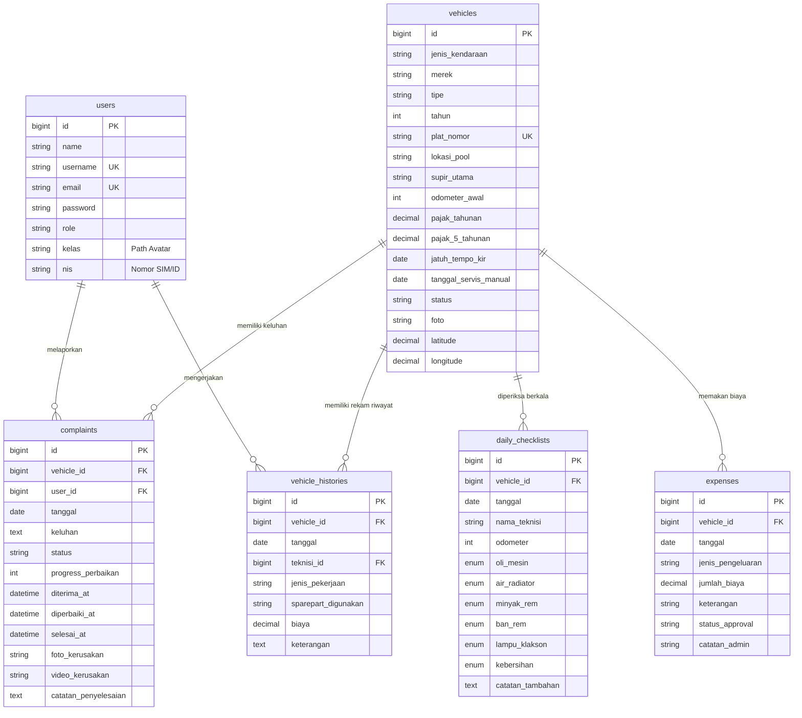
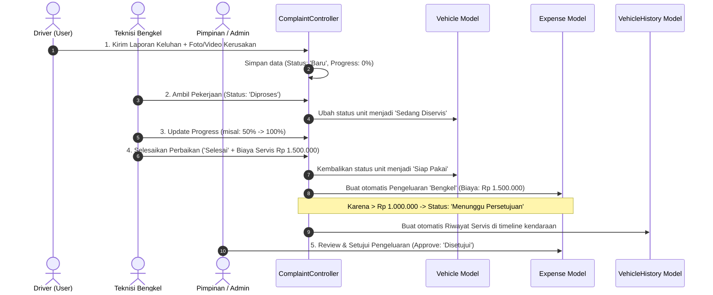
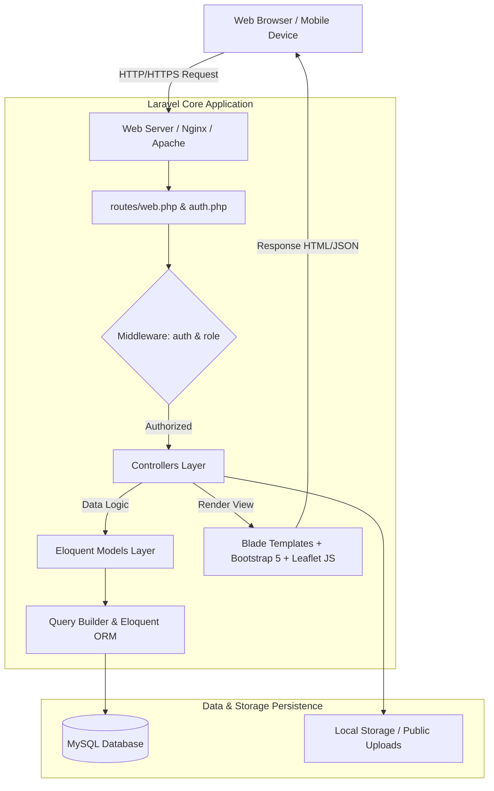

# Dokumentasi Resmi & Analisis Lengkap Sistem - Fleet Management System

Dokumentasi ini menyajikan panduan arsitektur, daftar modul fungsional, kamus data, diagram alur bisnis (*business process*), matriks hak akses (*RBAC*), dan endpoint rute dari **Fleet Management System (Sistem Manajemen Armada)** berbasis Laravel 12. Dokumentasi ini disusun secara presisi berdasarkan implementasi nyata pada kode sumber (*source code*).

---

## 1. IKHTISAR SISTEM (SYSTEM OVERVIEW)

*Fleet Management System* adalah platform manajemen armada terintegrasi yang dirancang untuk mengontrol seluruh siklus hidup operasional kendaraan perusahaan, mulai dari:
1. **Manajemen Data Armada & Pajak:** Pencatatan spesifikasi kendaraan, status fisik, foto unit, pelacakan pajak tahunan, pajak 5 tahunan, dan uji KIR.
2. **Sistem Peringatan Servis Otomatis (Smart Maintenance Alert):** Deteksi otomatis jatuh tempo servis berdasarkan jarak tempuh (kelipatan 5.000 KM) dan waktu (notifikasi H-7 atau interval 3 bulan).
3. **Pelacakan Posisi Armada Real-time (Live GPS Tracking):** Visualisasi sebaran armada di peta interaktif (*Leaflet.js + OpenStreetMap*) dengan fitur auto-polling API koordinat GPS.
4. **Pemeriksaan Harian (Daily Inspection Checklist):** Pengecekan 6 parameter kelaikan jalan oleh teknisi/driver yang secara otomatis menyinkronkan odometer fisik terkini ke sistem.
5. **Manajemen Keluhan & Siklus Perbaikan (Complaint to Repair Flow):** Pelaporan kendala oleh pengemudi dilengkapi foto/video kerusakan, pelacakan persentase *progress* perbaikan, hingga pencatatan otomatis ke riwayat servis dan rekap pengeluaran bengkel.
6. **Sistem Otorisasi Anggaran (Approval System):** Validasi berjenjang untuk pengeluaran biaya operasional berbiaya besar (> Rp 1.000.000) oleh Pimpinan/Admin.
7. **Dukungan Multi-bahasa (Localization):** Antarmuka dwibahasa (Bahasa Indonesia & Bahasa Inggris).

---

## 2. DAFTAR MODUL UTAMA & FITUR

### Modul 1: Autentikasi & Keamanan (Authentication)
* **Tujuan:** Mengelola autentikasi login pengguna dengan proteksi sesi (*session fixation protection*), multi-role redirection, dan logout aman.
* **Alur Bisnis:**
  1. Pengguna mengakses form login di `/login`.
  2. Input data diverifikasi otomatis apakah berupa alamat email atau username.
  3. `Auth::attempt` dijalankan. Jika valid, session diregenerasi dan diarahkan ke Dashboard sesuai hak akses.
  4. Pengguna dapat melakukan logout yang membatalkan sesi dan meregenerasi token CSRF.
* **Controller:** [AuthController](file:///c:/xampppp/htdocs/belajar-laravel/app/Http/Controllers/AuthController.php)
* **Model & Tabel:** [User](file:///c:/xampppp/htdocs/belajar-laravel/app/Models/User.php) (`users`)
* **Endpoint Rute:**
  * `GET /login` (Name: `login`)
  * `POST /login`
  * `POST /logout` (Name: `logout`)

---

### Modul 2: Dashboard Eksekutif & Monitoring Operasional
* **Tujuan:** Menampilkan visualisasi analitik real-time, status armada, jatuh tempo dokumen kendaraan, ringkasan pengeluaran, leaderboard teknisi, dan aksi cepat berdasarkan peran pengguna.
* **Alur Bisnis:**
  1. Pengguna masuk ke `/dashboard`.
  2. Sistem membaca `$user->role`:
     * **Super Admin / Admin / Pimpinan:** Memantau ringkasan biaya bulanan, pengeluaran menunggu persetujuan (*pending approval*), keluhan aktif, chart armada terboros, serta kalender jatuh tempo KIR & servis.
     * **Teknisi:** Memantau daftar keluhan yang siap ditangani, jumlah checklist yang diselesaikan hari ini, dan aksi cepat perubahan status armada.
     * **Driver (User):** Memantau kendaraan yang ditugaskan, riwayat keluhan pribadi, dan status kesiapan unit.
* **Controller:** [DashboardController](file:///c:/xampppp/htdocs/belajar-laravel/app/Http/Controllers/DashboardController.php)
* **Model:** [Vehicle](file:///c:/xampppp/htdocs/belajar-laravel/app/Models/Vehicle.php), [Complaint](file:///c:/xampppp/htdocs/belajar-laravel/app/Models/Complaint.php), [DailyChecklist](file:///c:/xampppp/htdocs/belajar-laravel/app/Models/DailyChecklist.php), [Expense](file:///c:/xampppp/htdocs/belajar-laravel/app/Models/Expense.php), [User](file:///c:/xampppp/htdocs/belajar-laravel/app/Models/User.php)
* **Endpoint Rute:**
  * `GET /dashboard` (Name: `dashboard`)

---

### Modul 3: Pelacakan Armada Real-Time (Live GPS Fleet Tracking)
* **Tujuan:** Memvisualisasikan posisi armada di peta geografis digital interaktif (*Leaflet.js*), memantau status gerak/servis, dan memperbarui koordinat posisi kendaraan secara dinamis.
* **Alur Bisnis:**
  1. Pengguna membuka menu Pelacakan (`/tracking`).
  2. Sistem memuat seluruh armada dengan koordinat latitude & longitude aktif. Jika belum ada koordinat GPS riil, sistem memberikan titik pusat pool secara terdistribusi.
  3. Peta menampilkan marker kustom berbasis tipe kendaraan (Truk Boks, Pick Up, Motor, Mobil) dan warna status:
     * 🟢 **Hijau (Ready):** Kendaraan Siap Pakai dan kondisi dokumen aman.
     * 🟡 **Kuning (Servis/Perhatian):** Mendekati jatuh tempo KIR/Servis atau sedang dalam perbaikan ringan.
     * 🔴 **Merah (Peringatan):** Melewati jatuh tempo KIR/Servis atau keluhan mendesak.
  4. Pengemudi atau Admin dapat memperbarui koordinat GPS secara instan melalui API GPS bawaan browser/perangkat (`/tracking/{vehicle}/location`).
  5. JavaScript melakukan polling otomatis ke `/tracking/api/vehicles` untuk menyegarkan posisi marker tanpa *reload* halaman.
* **Controller:** [TrackingController](file:///c:/xampppp/htdocs/belajar-laravel/app/Http/Controllers/TrackingController.php)
* **Model:** [Vehicle](file:///c:/xampppp/htdocs/belajar-laravel/app/Models/Vehicle.php)
* **Endpoint Rute:**
  * `GET /tracking` (Name: `tracking.index`)
  * `GET /tracking/api/vehicles` (Name: `tracking.api`)
  * `POST /tracking/{vehicle}/location` (Name: `tracking.updateLocation`)
  * `PUT /vehicles/{vehicle}/location` (Name: `vehicles.updateLocation`)

---

### Modul 4: Data Master Kendaraan (Vehicles Management)
* **Tujuan:** Mengelola inventaris aset kendaraan, spesifikasi teknis, dokumen legalitas (KIR, Pajak Tahunan, Pajak 5 Tahunan), foto kendaraan, dan kalkulasi otomatis status pemeliharaan.
* **Alur Bisnis:**
  1. **Admin** menginput data kendaraan (Merk, Tipe, Plat Nomor, Tahun, Odometer Awal, Lokasi Pool, Supir Utama, Pajak, Jatuh Tempo KIR, dan Foto Unit).
  2. Sistem menghitung secara otomatis:
     * **Status KIR:** Hijau (>30 hari), Kuning ($\le$ 30 hari), Merah (lewat jatuh tempo).
     * **KM Menuju Servis:** Dihitung dari `(Odometer Saat Servis Terakhir + 5000 KM) - Odometer Terkini`.
     * **Status Servis Berkala:** Peringatan H-7 sebelum estimasi waktu 3 bulan atau sisa $\le$ 500 KM.
  3. **Admin & Teknisi** dapat memperbarui status operasional kendaraan (`Siap Pakai`, `Sedang Diservis`, `Selesai`) lewat aksi cepat.
* **Controller:** [VehicleController](file:///c:/xampppp/htdocs/belajar-laravel/app/Http/Controllers/VehicleController.php)
* **Model:** [Vehicle](file:///c:/xampppp/htdocs/belajar-laravel/app/Models/Vehicle.php)
* **Endpoint Rute:**
  * `GET /vehicles` (Name: `vehicles.index`)
  * `GET /vehicles/{vehicle}` (Name: `vehicles.show`)
  * `GET /vehicles-create` (Name: `vehicles.create`) - *Admin/Superadmin*
  * `POST /vehicles` (Name: `vehicles.store`) - *Admin/Superadmin*
  * `GET /vehicles/{vehicle}/edit` (Name: `vehicles.edit`) - *Admin/Superadmin*
  * `PUT /vehicles/{vehicle}` (Name: `vehicles.update`) - *Admin/Superadmin*
  * `DELETE /vehicles/{vehicle}` (Name: `vehicles.destroy`) - *Admin/Superadmin*
  * `PUT /vehicles/{vehicle}/status` (Name: `vehicles.updateStatus`) - *Admin/Teknisi*
  * `GET /vehicles/{vehicle}/read-notification` (Name: `vehicles.readNotification`)

---

### Modul 5: Pemeriksaan Harian Kendaraan (Daily Checklist)
* **Tujuan:** Memastikan kelaikan fisik armada sebelum/sesudah beroperasi serta mencatat kenaikan jarak tempuh (odometer) secara berkesinambungan.
* **Alur Bisnis:**
  1. Teknisi/Driver melakukan inspeksi 6 parameter standar:
     * Oli Mesin (`OK` / `Not OK`)
     * Air Radiator (`OK` / `Not OK`)
     * Minyak Rem (`OK` / `Not OK`)
     * Ban & Rem (`OK` / `Not OK`)
     * Lampu & Klakson (`OK` / `Not OK`)
     * Kebersihan Kendaraan (`OK` / `Not OK`)
  2. Nilai odometer terkini yang diinput pada form checklist akan otomatis memperbarui data odometer kendaraan di sistem.
* **Controller:** [DailyChecklistController](file:///c:/xampppp/htdocs/belajar-laravel/app/Http/Controllers/DailyChecklistController.php)
* **Model:** [DailyChecklist](file:///c:/xampppp/htdocs/belajar-laravel/app/Models/DailyChecklist.php), [Vehicle](file:///c:/xampppp/htdocs/belajar-laravel/app/Models/Vehicle.php)
* **Endpoint Rute:**
  * `GET /checklist` (Name: `checklist.index`)
  * `GET /checklist-create` (Name: `checklist.create`)
  * `POST /checklist` (Name: `checklist.store`)
  * `GET /checklist/{checklist}` (Name: `checklist.show`)
  * `PUT /checklist/{checklist}/odometer` (Name: `checklist.updateOdometer`)
  * `DELETE /checklist/{checklist}` (Name: `checklist.destroy`) - *Admin/Teknisi*

---

### Modul 6: Rekap Biaya Operasional & Approval Anggaran (Expenses)
* **Tujuan:** Mencatat seluruh transaksi biaya kendaraan (BBM, Tol, Bengkel, Pajak, Parkir, Lainnya) dengan mekanisme validasi dan otorisasi anggaran berjenjang.
* **Alur Bisnis:**
  1. Admin/Teknisi mencatat pengeluaran operasional.
  2. **Aturan Approval Otomatis:**
     * Pengeluaran normal $\le$ Rp 1.000.000 langsung berstatus `Disetujui` (atau default antrean).
     * Pengeluaran besar > Rp 1.000.000 otomatis berstatus `Menunggu Persetujuan`.
  3. **Super Admin, Admin, dan Pimpinan** dapat meninjau, menyetujui (`Disetujui`), atau menolak (`Ditolak`) pengeluaran melalui rute `/expenses/{expense}/approve`.
* **Controller:** [ExpenseController](file:///c:/xampppp/htdocs/belajar-laravel/app/Http/Controllers/ExpenseController.php)
* **Model:** [Expense](file:///c:/xampppp/htdocs/belajar-laravel/app/Models/Expense.php), [Vehicle](file:///c:/xampppp/htdocs/belajar-laravel/app/Models/Vehicle.php)
* **Endpoint Rute:**
  * `GET /expenses` (Name: `expenses.index`)
  * `GET /expenses-create` (Name: `expenses.create`)
  * `POST /expenses` (Name: `expenses.store`)
  * `PUT /expenses/{expense}/approve` (Name: `expenses.approve`) - *Superadmin/Admin/Pimpinan*
  * `DELETE /expenses/{expense}` (Name: `expenses.destroy`) - *Superadmin/Admin/Teknisi*

---

### Modul 7: Laporan Keluhan & Kendala Armada (Complaints)
* **Tujuan:** Memfasilitasi pelaporan kendala kendaraan oleh pengemudi, dilengkapi bukti visual (foto & video), pelacakan progres perbaikan teknisi, serta integrasi otomatis ke rekap biaya dan riwayat servis.
* **Alur Bisnis:**
  1. **Pengemudi (Driver/User)** mengirimkan formulir laporan keluhan (status awal: `Baru`), melampirkan foto/video kerusakan.
  2. **Teknisi** menerima laporan dan mengubah status menjadi `Diproses` (status kendaraan otomatis beralih ke `Sedang Diservis`, timestamp `diterima_at` / `diperbaiki_at` tercatat).
  3. Teknisi memperbarui persentase *progress* perbaikan (misal: 25%, 50%, 75%, 100%).
  4. Ketika perbaikan selesai:
     * Status keluhan diubah menjadi `Selesai` (`selesai_at` tercatat).
     * Status kendaraan otomatis dipulihkan menjadi `Siap Pakai`.
     * Jika teknisi mengisi nominal biaya servis, sistem **otomatis** membuat entri pengeluaran kategori `Bengkel` di tabel `expenses` dan entri riwayat di `vehicle_histories`.
* **Controller:** [ComplaintController](file:///c:/xampppp/htdocs/belajar-laravel/app/Http/Controllers/ComplaintController.php)
* **Model:** [Complaint](file:///c:/xampppp/htdocs/belajar-laravel/app/Models/Complaint.php), [Vehicle](file:///c:/xampppp/htdocs/belajar-laravel/app/Models/Vehicle.php), [Expense](file:///c:/xampppp/htdocs/belajar-laravel/app/Models/Expense.php), [VehicleHistory](file:///c:/xampppp/htdocs/belajar-laravel/app/Models/VehicleHistory.php)
* **Endpoint Rute:**
  * `GET /complaints` (Name: `complaints.index`)
  * `GET /complaints-create` (Name: `complaints.create`)
  * `POST /complaints` (Name: `complaints.store`)
  * `PUT /complaints/{complaint}/status` (Name: `complaints.updateStatus`) - *Superadmin/Teknisi*

---

### Modul 8: Riwayat Servis & Perbaikan (Vehicle Histories)
* **Tujuan:** Mendokumentasikan *logbook* perbaikan kendaraan secara detail (jenis pekerjaan, sparepart yang diganti, teknisi penanggung jawab, dan rincian biaya) sebagai rekam jejak kesehatan armada jangka panjang.
* **Alur Bisnis:**
  1. Riwayat dapat dicatat secara manual oleh Admin/Teknisi atau terbuat secara otomatis saat keluhan pengemudi diselesaikan.
  2. Data riwayat disajikan dalam format *Timeline* interaktif pada halaman detail kendaraan (`vehicles.show`).
* **Controller:** [VehicleHistoryController](file:///c:/xampppp/htdocs/belajar-laravel/app/Http/Controllers/VehicleHistoryController.php)
* **Model:** [VehicleHistory](file:///c:/xampppp/htdocs/belajar-laravel/app/Models/VehicleHistory.php)
* **Endpoint Rute:**
  * `GET /vehicle-histories` (Name: `vehicle-histories.index`)
  * `GET /vehicle-histories/create` (Name: `vehicle-histories.create`)
  * `POST /vehicle-histories` (Name: `vehicle-histories.store`)
  * `GET /vehicle-histories/{vehicle_history}/edit` (Name: `vehicle-histories.edit`)
  * `PUT /vehicle-histories/{vehicle_history}` (Name: `vehicle-histories.update`)
  * `DELETE /vehicle-histories/{vehicle_history}` (Name: `vehicle-histories.destroy`)

---

### Modul 9: Manajemen Pengguna & Profil Akun (Users & Profile)
* **Tujuan:** Mengelola akun sistem seluruh karyawan (Role: Super Admin, Admin, Teknisi, Pimpinan, Driver) serta memungkinkan pengguna memperbarui profil dan foto avatar mandiri.
* **Alur Bisnis:**
  1. **Super Admin / Admin** dapat menambah, mengedit, melihat, dan menghapus akun pengguna serta menetapkan *role*.
  2. Seluruh pengguna terautentikasi dapat membuka modal/halaman profil untuk mengganti nama, email, password, dan mengunggah foto avatar profil.
* **Controller:** [UserController](file:///c:/xampppp/htdocs/belajar-laravel/app/Http/Controllers/UserController.php)
* **Model:** [User](file:///c:/xampppp/htdocs/belajar-laravel/app/Models/User.php)
* **Endpoint Rute:**
  * `GET /users` (Name: `users.index`) - *Superadmin/Admin*
  * `GET /users-create` (Name: `users.create`) - *Superadmin/Admin*
  * `POST /users` (Name: `users.store`) - *Superadmin/Admin*
  * `GET /users/{user}/edit` (Name: `users.edit`) - *Superadmin/Admin*
  * `PUT /users/{user}` (Name: `users.update`) - *Superadmin/Admin*
  * `DELETE /users/{user}` (Name: `users.destroy`) - *Superadmin/Admin*
  * `POST /profile/update` (Name: `profile.update`) - *Semua Pengguna Terautentikasi*

---

### Modul 10: Pengaturan Bahasa (Localization Switcher)
* **Tujuan:** Menyediakan pengalaman antarmuka multibahasa (*Indonesian* & *English*).
* **Endpoint Rute:**
  * `GET /set-locale/{locale}` (Name: `set-locale`) - Parameter: `id` atau `en`.

---

## 3. MATRIKS HAK AKSES PERAN (ROLE-BASED ACCESS CONTROL)

Sistem menggunakan 5 peran (*roles*) dengan pembagian wewenang yang tegas:

| Modul / Fitur | Super Admin | Admin Fleet | Teknisi | Pimpinan (Manager) | Driver (User) |
| :--- | :---: | :---: | :---: | :---: | :---: |
| **Dashboard Analytics** | ✅ Lengkap | ✅ Lengkap | ✅ Operasional | ✅ Finansial & KPI | ✅ Armada Saya |
| **Live GPS Tracking** | ✅ Akses | ✅ Akses | ✅ Akses | ✅ Akses | ✅ Akses |
| **Data Kendaraan (Lihat)** | ✅ Ya | ✅ Ya | ✅ Ya | ✅ Ya | ✅ Ya |
| **Data Kendaraan (Tambah/Edit/Hapus)**| ✅ Ya | ✅ Ya | ❌ Tidak | ❌ Tidak | ❌ Tidak |
| **Ubah Status Armada Cepat** | ✅ Ya | ✅ Ya | ✅ Ya | ❌ Tidak | ❌ Tidak |
| **Input Daily Checklist** | ✅ Ya | ✅ Ya | ✅ Ya | ❌ Tidak | ✅ Ya |
| **Hapus Daily Checklist** | ✅ Ya | ✅ Ya | ✅ Ya | ❌ Tidak | ❌ Tidak |
| **Rekap Biaya (Lihat/Tambah/Hapus)** | ✅ Ya | ✅ Ya | ✅ Tambah | ✅ Lihat | ❌ Tidak |
| **Approval Anggaran Biaya Besar** | ✅ Ya | ✅ Ya | ❌ Tidak | ✅ Ya | ❌ Tidak |
| **Buat Laporan Keluhan** | ✅ Ya | ✅ Ya | ✅ Ya | ✅ Ya | ✅ Ya |
| **Update Status & Progress Keluhan** | ✅ Ya | ❌ Tidak | ✅ Ya | ❌ Tidak | ❌ Tidak |
| **Kelola Riwayat Servis (CRUD)** | ✅ Ya | ✅ Ya | ✅ Ya | ❌ Tidak | ❌ Tidak |
| **Kelola Akun Pengguna (CRUD)** | ✅ Ya | ✅ Ya | ❌ Tidak | ❌ Tidak | ❌ Tidak |
| **Update Profil & Avatar Mandiri** | ✅ Ya | ✅ Ya | ✅ Ya | ✅ Ya | ✅ Ya |

---

## 4. KAMUS DATA & SKEMA DATABASE

### 1. Tabel `users`
| Kolom | Tipe Data | Keterangan |
| :--- | :--- | :--- |
| `id` | BIGINT (PK, Auto Increment) | ID Unik Pengguna |
| `name` | VARCHAR(255) | Nama Lengkap |
| `username` | VARCHAR(255) (Unique) | Username Login |
| `email` | VARCHAR(255) (Unique) | Alamat Email |
| `password` | VARCHAR(255) | Hash Sandi (Bcrypt) |
| `role` | ENUM / VARCHAR | `superadmin`, `admin`, `teknisi`, `pimpinan`, `user` |
| `kelas` | VARCHAR(255) (Nullable) | Jalur Path File Avatar Profil |
| `nis` | VARCHAR(255) (Nullable) | Nomor Induk / SIM Karyawan |
| `remember_token` | VARCHAR(100) (Nullable) | Token Remember Me |
| `created_at`, `updated_at` | TIMESTAMP | Waktu Dibuat & Diperbarui |

---

### 2. Tabel `vehicles`
| Kolom | Tipe Data | Keterangan |
| :--- | :--- | :--- |
| `id` | BIGINT (PK, Auto Increment) | ID Unik Kendaraan |
| `jenis_kendaraan` | VARCHAR(255) | Jenis (Truk Boks, Pick Up, Mobil, Motor) |
| `merek` | VARCHAR(255) | Merek (Mitsubishi, Toyota, Isuzu, Honda, dll.) |
| `tipe` | VARCHAR(255) | Tipe Varian (Canter HD, Gran Max, Hilux, dll.) |
| `tahun` | INT | Tahun Pembuatan Unit |
| `plat_nomor` | VARCHAR(255) (Unique) | Nomor Polisi / Plat Kendaraan |
| `lokasi_pool` | VARCHAR(255) (Nullable) | Nama Lokasi Pool / Depo Parkir |
| `supir_utama` | VARCHAR(255) (Nullable) | Nama Driver Penanggung Jawab |
| `odometer_awal` | INT | Angka Kilometer Awal |
| `pajak_tahunan` | DECIMAL(15,2) (Nullable) | Biaya Pajak Tahunan |
| `pajak_5_tahunan`| DECIMAL(15,2) (Nullable) | Biaya Pajak Ganti Plat (5 Tahunan) |
| `jatuh_tempo_kir` | DATE (Nullable) | Tanggal Batas Akhir Uji Berkala KIR |
| `tanggal_servis_manual` | DATE (Nullable) | Override Tanggal Jadwal Servis Mendatang |
| `status` | VARCHAR(255) | `Siap Pakai`, `Sedang Diservis`, `Selesai` |
| `foto` | VARCHAR(255) (Nullable) | Path File Foto Kendaraan di Storage |
| `latitude` | DECIMAL(10,8) (Nullable) | Titik Koordinat Garis Lintang GPS |
| `longitude` | DECIMAL(11,8) (Nullable) | Titik Koordinat Garis Bujur GPS |
| `created_at`, `updated_at` | TIMESTAMP | Waktu Dibuat & Diperbarui |

---

### 3. Tabel `daily_checklists`
| Kolom | Tipe Data | Keterangan |
| :--- | :--- | :--- |
| `id` | BIGINT (PK, Auto Increment) | ID Unik Checklist |
| `vehicle_id` | BIGINT (FK $\rightarrow$ `vehicles.id`) | Relasi ke Kendaraan |
| `tanggal` | DATE | Tanggal Pemeriksaan |
| `nama_teknisi` | VARCHAR(255) | Nama Petugas Pemeriksa |
| `odometer` | INT | Angka Odometer saat diperiksa |
| `oli_mesin` | ENUM('OK','Not OK') | Kondisi Volume & Kualitas Oli |
| `air_radiator` | ENUM('OK','Not OK') | Kondisi Air Pendingin Radiator |
| `minyak_rem` | ENUM('OK','Not OK') | Kondisi Minyak Rem |
| `ban_rem` | ENUM('OK','Not OK') | Kondisi Ketebalan Ban & Kampas Rem |
| `lampu_klakson`| ENUM('OK','Not OK') | Kondisi Kelistrikan & Penerangan |
| `kebersihan` | ENUM('OK','Not OK') | Kondisi Kebersihan Kabin & Bodi |
| `catatan_tambahan` | TEXT (Nullable) | Catatan Khusus Pemeriksaan |
| `created_at`, `updated_at` | TIMESTAMP | Waktu Dibuat & Diperbarui |

---

### 4. Tabel `expenses`
| Kolom | Tipe Data | Keterangan |
| :--- | :--- | :--- |
| `id` | BIGINT (PK, Auto Increment) | ID Unik Pengeluaran |
| `vehicle_id` | BIGINT (FK $\rightarrow$ `vehicles.id`) | Relasi ke Kendaraan |
| `tanggal` | DATE | Tanggal Transaksi |
| `jenis_pengeluaran` | VARCHAR(255) | `BBM`, `Tol`, `Bengkel`, `Parkir`, `Pajak`, `Lainnya` |
| `jumlah_biaya` | DECIMAL(15,2) | Nominal Biaya (Rupiah) |
| `keterangan` | VARCHAR(255) (Nullable) | Deskripsi Rincian Pengeluaran |
| `status_approval` | VARCHAR(255) | `Menunggu Persetujuan`, `Disetujui`, `Ditolak` |
| `catatan_admin` | VARCHAR(255) (Nullable) | Catatan Alasan Persetujuan/Penolakan |
| `created_at`, `updated_at` | TIMESTAMP | Waktu Dibuat & Diperbarui |

---

### 5. Tabel `complaints`
| Kolom | Tipe Data | Keterangan |
| :--- | :--- | :--- |
| `id` | BIGINT (PK, Auto Increment) | ID Unik Laporan Keluhan |
| `vehicle_id` | BIGINT (FK $\rightarrow$ `vehicles.id`) | Relasi ke Kendaraan |
| `user_id` | BIGINT (FK $\rightarrow$ `users.id`) | Relasi Pengemudi Pelapor |
| `tanggal` | DATE | Tanggal Laporan Dibuat |
| `keluhan` | TEXT | Deskripsi Kerusakan / Kendala |
| `status` | VARCHAR(255) | `Baru`, `Diproses`, `Selesai` |
| `progress_perbaikan` | INT (Default: 0) | Persentase Progres (0 - 100%) |
| `diterima_at` | DATETIME (Nullable) | Waktu Teknisi Menerima Tugas |
| `diperbaiki_at` | DATETIME (Nullable) | Waktu Pekerjaan Dimulai |
| `selesai_at` | DATETIME (Nullable) | Waktu Pekerjaan Selesai |
| `foto_kerusakan` | VARCHAR(255) (Nullable) | Path Berkas Foto Bukti Kerusakan |
| `video_kerusakan` | VARCHAR(255) (Nullable) | Path Berkas Video Bukti Kerusakan |
| `catatan_penyelesaian` | TEXT (Nullable) | Laporan Tindakan Teknisi |
| `created_at`, `updated_at` | TIMESTAMP | Waktu Dibuat & Diperbarui |

---

### 6. Tabel `vehicle_histories`
| Kolom | Tipe Data | Keterangan |
| :--- | :--- | :--- |
| `id` | BIGINT (PK, Auto Increment) | ID Unik Riwayat Servis |
| `vehicle_id` | BIGINT (FK $\rightarrow$ `vehicles.id`) | Relasi ke Kendaraan |
| `tanggal` | DATE | Tanggal Pengerjaan Servis |
| `teknisi_id` | BIGINT (FK $\rightarrow$ `users.id`, Nullable) | Teknisi Penanggung Jawab |
| `jenis_pekerjaan` | VARCHAR(255) | Nama/Kategori Servis yang dilakukan |
| `sparepart_digunakan`| VARCHAR(500) (Nullable) | Daftar Penggantian Suku Cadang |
| `biaya` | DECIMAL(15,2) | Total Biaya Servis |
| `keterangan` | TEXT (Nullable) | Catatan Tambahan Servis |
| `created_at`, `updated_at` | TIMESTAMP | Waktu Dibuat & Diperbarui |

---

## 5. DIAGRAM ARSITEKTUR & PROSES BISNIS

### A. Entity Relationship Diagram (ERD)



---

### B. Sequence Diagram: Alur Siklus Keluhan, Servis, Keuangan & Riwayat



---

### C. Diagram Arsitektur Aplikasi (Component Architecture)



---

## 6. DAFTAR LENGKAP ENDPOINT ROUTE (ROUTING TABLE)

| Method | URI | Route Name | Middleware | Controller & Method | Deskripsi |
| :--- | :--- | :--- | :--- | :--- | :--- |
| `GET` | `/` | - | `web` | Closure | Redirect ke `/dashboard` |
| `GET` | `/login` | `login` | `guest` | `AuthController@showLoginForm` | Menampilkan Form Login |
| `POST` | `/login` | - | `guest` | `AuthController@login` | Memproses Autentikasi Login |
| `POST` | `/logout` | `logout` | `auth` | `AuthController@logout` | Mengakhiri Sesi Pengguna |
| `GET` | `/set-locale/{locale}` | `set-locale` | `web` | Closure | Mengubah Bahasa (ID/EN) |
| `GET` | `/dashboard` | `dashboard` | `auth` | `DashboardController@index` | Dashboard Utama Sistem |
| `GET` | `/tracking` | `tracking.index` | `auth` | `TrackingController@index` | Peta Pelacakan Armada GPS |
| `GET` | `/tracking/api/vehicles` | `tracking.api` | `auth` | `TrackingController@apiVehicles` | API JSON Koordinat Armada |
| `POST` | `/tracking/{vehicle}/location`| `tracking.updateLocation` | `auth` | `TrackingController@updateLocation`| Update Koordinat GPS Kendaraan |
| `PUT` | `/vehicles/{vehicle}/location` | `vehicles.updateLocation` | `auth` | `TrackingController@updateLocation`| Update Koordinat GPS (Alias) |
| `GET` | `/vehicles` | `vehicles.index` | `auth` | `VehicleController@index` | Daftar Master Armada |
| `GET` | `/vehicles/{vehicle}` | `vehicles.show` | `auth` | `VehicleController@show` | Detail Informasi & Timeline Armada |
| `GET` | `/vehicles/{vehicle}/read-notification` | `vehicles.readNotification` | `auth` | `VehicleController@readNotification` | Tandai Notifikasi Servis Dibaca |
| `PUT` | `/vehicles/{vehicle}/status` | `vehicles.updateStatus` | `auth, role:superadmin,admin,teknisi` | `VehicleController@updateStatus` | Ubah Cepat Status Kendaraan |
| `GET` | `/vehicles-create` | `vehicles.create` | `auth, role:superadmin,admin` | `VehicleController@create` | Form Tambah Armada Baru |
| `POST` | `/vehicles` | `vehicles.store` | `auth, role:superadmin,admin` | `VehicleController@store` | Simpan Data Armada Baru |
| `GET` | `/vehicles/{vehicle}/edit` | `vehicles.edit` | `auth, role:superadmin,admin` | `VehicleController@edit` | Form Edit Data Armada |
| `PUT` | `/vehicles/{vehicle}` | `vehicles.update` | `auth, role:superadmin,admin` | `VehicleController@update` | Simpan Perubahan Data Armada |
| `DELETE`| `/vehicles/{vehicle}` | `vehicles.destroy` | `auth, role:superadmin,admin` | `VehicleController@destroy` | Hapus Data Armada |
| `GET` | `/checklist` | `checklist.index` | `auth` | `DailyChecklistController@index` | Riwayat Pemeriksaan Harian |
| `GET` | `/checklist/{checklist}` | `checklist.show` | `auth` | `DailyChecklistController@show` | Detail Lembar Pemeriksaan |
| `GET` | `/checklist-create` | `checklist.create` | `auth` | `DailyChecklistController@create` | Form Lembar Checklist Baru |
| `POST` | `/checklist` | `checklist.store` | `auth` | `DailyChecklistController@store` | Simpan Hasil Pemeriksaan |
| `PUT` | `/checklist/{checklist}/odometer` | `checklist.updateOdometer` | `auth` | `DailyChecklistController@updateOdometer` | Perbarui Angka Odometer |
| `DELETE`| `/checklist/{checklist}` | `checklist.destroy` | `auth, role:superadmin,admin,teknisi` | `DailyChecklistController@destroy` | Hapus Data Checklist |
| `GET` | `/expenses` | `expenses.index` | `auth, role:superadmin,admin,teknisi` | `ExpenseController@index` | Daftar Rekapitulasi Biaya |
| `GET` | `/expenses-create` | `expenses.create` | `auth, role:superadmin,admin,teknisi` | `ExpenseController@create` | Form Tambah Biaya Operasional |
| `POST` | `/expenses` | `expenses.store` | `auth, role:superadmin,admin,teknisi` | `ExpenseController@store` | Simpan Catatan Biaya |
| `PUT` | `/expenses/{expense}/approve` | `expenses.approve` | `auth, role:superadmin,admin,pimpinan` | `ExpenseController@approve` | Setujui/Tolak Pengeluaran |
| `DELETE`| `/expenses/{expense}` | `expenses.destroy` | `auth, role:superadmin,admin,teknisi` | `ExpenseController@destroy` | Hapus Catatan Biaya |
| `GET` | `/complaints` | `complaints.index` | `auth` | `ComplaintController@index` | Daftar Laporan Keluhan |
| `GET` | `/complaints-create` | `complaints.create` | `auth` | `ComplaintController@create` | Form Buat Keluhan Kerusakan |
| `POST` | `/complaints` | `complaints.store` | `auth` | `ComplaintController@store` | Simpan Laporan Keluhan |
| `PUT` | `/complaints/{complaint}/status` | `complaints.updateStatus` | `auth, role:superadmin,teknisi` | `ComplaintController@updateStatus` | Update Progres & Status Keluhan |
| `GET` | `/vehicle-histories` | `vehicle-histories.index` | `auth, role:superadmin,admin,teknisi` | `VehicleHistoryController@index` | Daftar Riwayat Servis |
| `GET` | `/vehicle-histories/create` | `vehicle-histories.create` | `auth, role:superadmin,admin,teknisi` | `VehicleHistoryController@create` | Form Tambah Riwayat Servis |
| `POST` | `/vehicle-histories` | `vehicle-histories.store` | `auth, role:superadmin,admin,teknisi` | `VehicleHistoryController@store` | Simpan Data Riwayat Servis |
| `GET` | `/vehicle-histories/{id}/edit` | `vehicle-histories.edit` | `auth, role:superadmin,admin,teknisi` | `VehicleHistoryController@edit` | Form Edit Riwayat Servis |
| `PUT` | `/vehicle-histories/{id}` | `vehicle-histories.update` | `auth, role:superadmin,admin,teknisi` | `VehicleHistoryController@update` | Simpan Edit Riwayat Servis |
| `DELETE`| `/vehicle-histories/{id}` | `vehicle-histories.destroy` | `auth, role:superadmin,admin,teknisi` | `VehicleHistoryController@destroy` | Hapus Data Riwayat Servis |
| `GET` | `/users` | `users.index` | `auth, role:superadmin,admin` | `UserController@index` | Manajemen Pengguna |
| `GET` | `/users-create` | `users.create` | `auth, role:superadmin,admin` | `UserController@create` | Form Tambah Pengguna Baru |
| `POST` | `/users` | `users.store` | `auth, role:superadmin,admin` | `UserController@store` | Simpan Pengguna Baru |
| `GET` | `/users/{user}/edit` | `users.edit` | `auth, role:superadmin,admin` | `UserController@edit` | Form Edit Pengguna |
| `PUT` | `/users/{user}` | `users.update` | `auth, role:superadmin,admin` | `UserController@update` | Simpan Perubahan Pengguna |
| `DELETE`| `/users/{user}` | `users.destroy` | `auth, role:superadmin,admin` | `UserController@destroy` | Hapus Pengguna |
| `POST` | `/profile/update` | `profile.update` | `auth` | `UserController@updateProfile` | Update Profil & Avatar Mandiri |

---

## 7. PANDUAN MENJALANKAN SISTEM & AKUN DEMO

### Persyaratan Sistem
* PHP $\ge$ 8.2 (dengan ekstensi `pdo_mysql`, `mbstring`, `fileinfo`, `gd`/`imagick`, `curl`)
* MySQL / MariaDB $\ge$ 8.0 (atau XAMPP aktif)
* Composer $\ge$ 2.x

### Langkah Instalasi
```bash
# 1. Pastikan berada di root direktori project
cd C:\xampppp\htdocs\belajar-laravel

# 2. Salin konfigurasi environment jika belum ada
copy .env.example .env

# 3. Buat application key
php artisan key:generate

# 4. Jalankan migrasi dan seeder database
php artisan migrate --seed

# 5. Buat link symbolic storage publik untuk media upload
php artisan storage:link

# 6. Jalankan web server lokal
php artisan serve
```

### Akun Demo Pengujian (Default Password: `password`)

| Peran (Role) | Username | Email | Kegunaan Pengujian |
| :--- | :--- | :--- | :--- |
| **Admin Fleet** | `admin_fleet` | `admin@fleet.com` | Akses penuh inventaris armada, user, approval pengeluaran |
| **Teknisi** | `teknisi_utama` | `teknisi@fleet.com` | Penanganan keluhan, update status servis, isi checklist |
| **Driver / Pengemudi** | `driver_utama` | `user@fleet.com` | Lapor keluhan foto/video, pelacakan armada saya |
| **Teknisi 2** | `teknisi_budi` | `budi.teknisi@fleet.com`| Leaderboard & logbook riwayat servis |
| **Driver 2** | `driver_dedi` | `dedi.driver@fleet.com` | Simulasi pengemudi unit armada B 9821 TXT |
