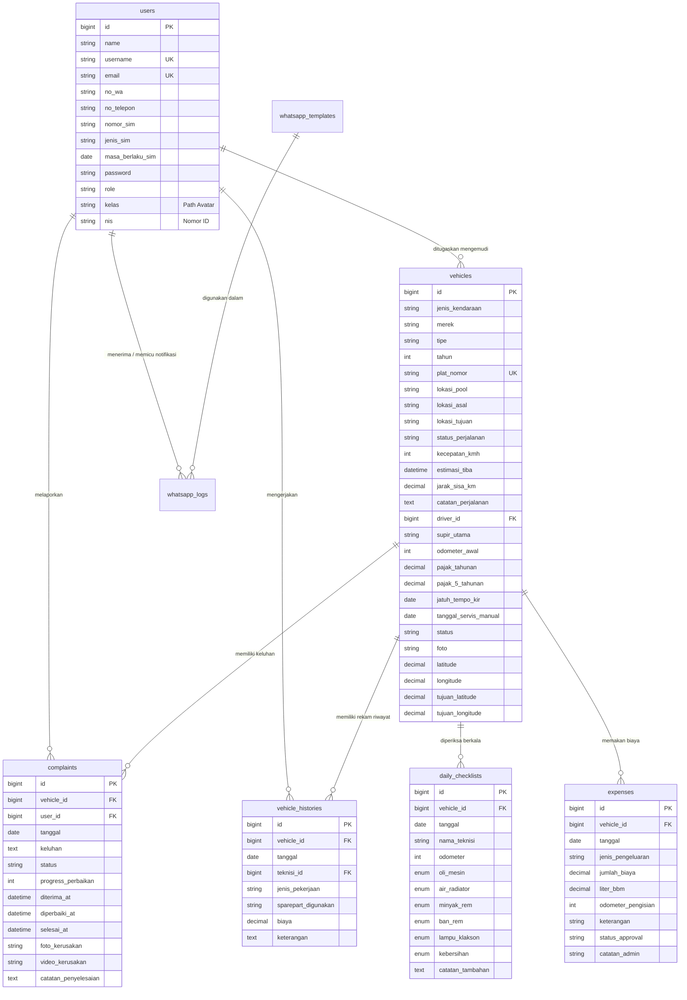
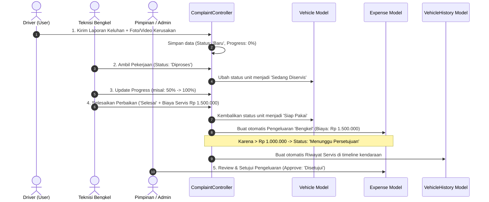
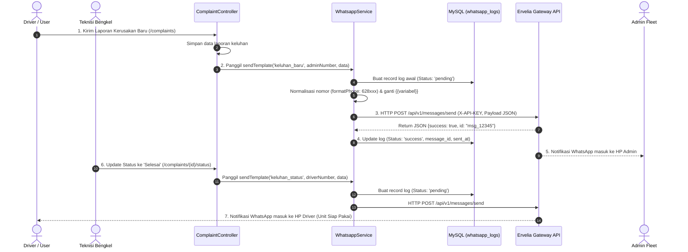
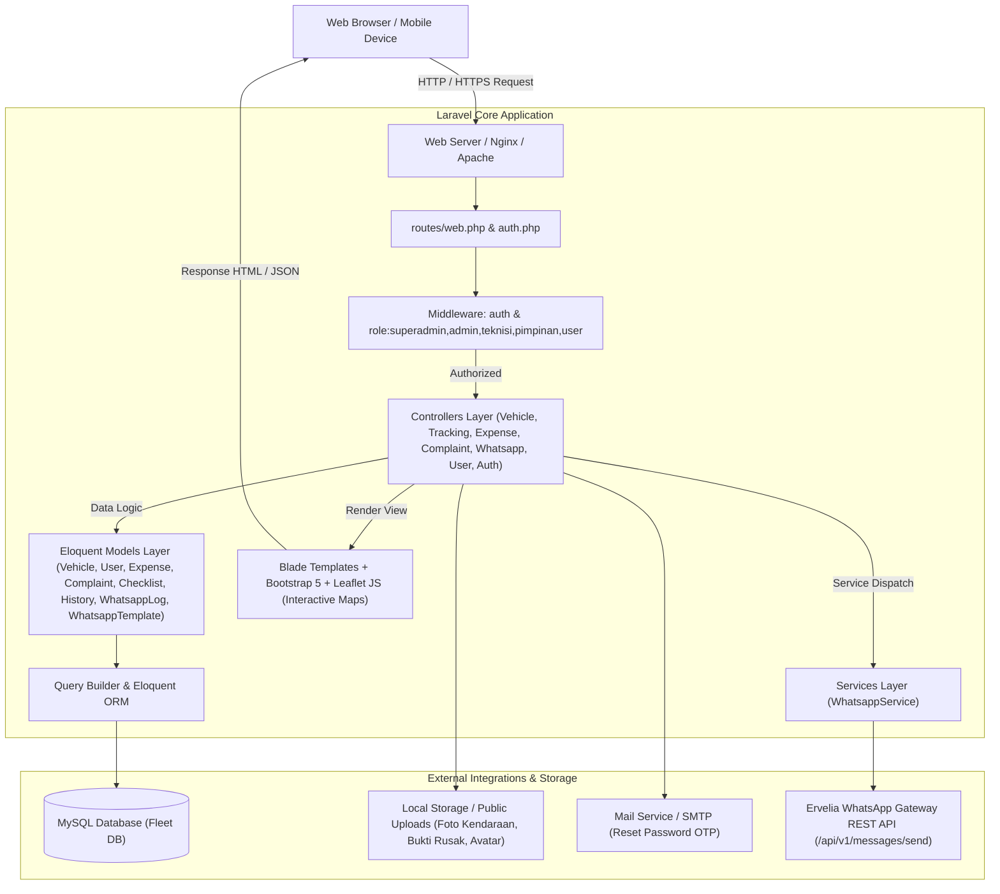

# Dokumentasi Resmi & Analisis Lengkap Sistem - Fleet Management System

Dokumentasi ini menyajikan panduan arsitektur, daftar modul fungsional, kamus data, diagram alur bisnis (*business process*), matriks hak akses (*RBAC*), dan endpoint rute dari **Fleet Management System (Sistem Manajemen Armada)** berbasis Laravel 12. Dokumentasi ini disusun secara presisi berdasarkan implementasi nyata pada kode sumber (*source code*).

---

## 1. IKHTISAR SISTEM (SYSTEM OVERVIEW)

*Fleet Management System* adalah platform manajemen armada terintegrasi yang dirancang untuk mengontrol seluruh siklus hidup operasional kendaraan perusahaan, mulai dari:
1. **Manajemen Data Armada, Pajak & Lisensi Driver:** Pencatatan spesifikasi lengkap kendaraan, status fisik, foto unit, pelacakan pajak tahunan, pajak 5 tahunan, uji KIR, serta penugasan dan masa berlaku SIM pengemudi.
2. **Sistem Peringatan Servis Otomatis (Smart Maintenance Alert):** Deteksi otomatis jatuh tempo servis berkala berdasarkan jarak tempuh (kelipatan 5.000 KM) dan waktu (notifikasi H-7 atau interval 3 bulan).
3. **Pelacakan Posisi Armada Real-time & Dispatcher Rute Pengiriman (Live GPS & Trip Manifest):** Visualisasi sebaran armada di peta interaktif (*Leaflet.js + OpenStreetMap*), penugasan rute pengiriman baru, telemetri kecepatan (*km/h*), sisa jarak (*km*), estimasi waktu tiba (*ETA*), tombol konfirmasi penyelesaian antar barang (*Complete Delivery*), dan sinkronisasi GPS perangkat.
4. **Pemeriksaan Harian (Daily Inspection Checklist):** Pengecekan 6 parameter kelaikan jalan oleh teknisi/driver yang secara otomatis menyinkronkan odometer fisik terkini ke sistem.
5. **Manajemen Keluhan & Siklus Perbaikan (Complaint to Repair Flow):** Pelaporan kendala oleh pengemudi dilengkapi foto/video kerusakan, pelacakan persentase *progress* perbaikan, hingga pencatatan otomatis ke riwayat servis dan rekap pengeluaran bengkel.
6. **Sistem Otorisasi Anggaran, Ekspor CSV & Telemetri BBM:** Validasi berjenjang untuk pengeluaran operasional berbiaya besar (> Rp 1.000.000) oleh Pimpinan/Admin, ekspor laporan pengeluaran ke CSV kompatibel Excel (UTF-8 BOM), serta modal pencatatan pengisian BBM instan dengan auto-update odometer.
7. **Keamanan Akun & Pemulihan Kata Sandi Berbasis OTP (Security & Password Recovery):** Proteksi *rate limiting* saat login, serta alur pemulihan kata sandi menggunakan kode OTP 6 digit yang dikirimkan via notifikasi email (*15 minutes validity*).
8. **Dukungan Multi-bahasa (Localization):** Antarmuka dwibahasa (Bahasa Indonesia & Bahasa Inggris).
9. **Integrasi Notifikasi Otomatis WhatsApp Gateway API (Ervelia Gateway / REST API Integration):** Pengiriman pesan instan otomatis berbasis event untuk laporan kerusakan baru, progres perbaikan, peringatan checklist bermasalah, approval anggaran perbaikan besar, pengingat jatuh tempo KIR/servis berkala, serta penugasan armada ke nomor WhatsApp pengemudi dan admin secara real-time.

---

## 2. DAFTAR MODUL UTAMA & FITUR

### Modul 1: Autentikasi, Keamanan & Pemulihan Kata Sandi (Authentication & Password Reset)
* **Tujuan:** Mengelola autentikasi login pengguna dengan proteksi sesi (*session fixation protection*), pembatasan percobaan login (*Rate Limiting*), *multi-role redirection*, dan alur pemulihan kata sandi mandiri via kode OTP 6 digit.
* **Alur Bisnis:**
  1. Pengguna mengakses form login di `/login`.
  2. Input data diverifikasi otomatis apakah berupa alamat email atau username.
  3. Sistem membatasi percobaan gagal maksimal 5 kali dalam 60 detik (*Rate Limiting*).
  4. `Auth::attempt` dijalankan. Jika valid, session diregenerasi dan diarahkan ke Dashboard sesuai peran (*role*).
  5. Jika pengguna lupa kata sandi:
     - Pengguna membuka `/forgot-password` dan memasukkan email/username.
     - Sistem membuat kode OTP numerik 6 digit acak (berlaku 15 menit) dan mengirimkannya via email notification (`ResetPasswordOtpNotification`).
     - Pengguna memasukkan kode OTP dan password baru di form `/reset-password/{token}`.
     - Sistem memverifikasi kecocokan OTP dan memperbarui password pengguna dengan enkripsi Bcrypt.
* **Controller:** [AuthController](file:///c:/xampppp/htdocs/belajar-laravel/app/Http/Controllers/AuthController.php)
* **Model & Tabel:** [User](file:///c:/xampppp/htdocs/belajar-laravel/app/Models/User.php) (`users`), `password_reset_tokens`
* **Endpoint Rute:**
  * `GET /login` (Name: `login`)
  * `POST /login`
  * `POST /logout` (Name: `logout`)
  * `GET /forgot-password` (Name: `password.request`)
  * `POST /forgot-password` (Name: `password.email`)
  * `GET /reset-password/{token}` (Name: `password.reset`)
  * `POST /reset-password` (Name: `password.update`)

---

### Modul 2: Dashboard Eksekutif & Monitoring Operasional
* **Tujuan:** Menampilkan visualisasi analitik real-time, status kesiapan armada, jatuh tempo dokumen kendaraan, ringkasan pengeluaran, leaderboard teknisi, dan aksi cepat berdasarkan peran pengguna.
* **Alur Bisnis:**
  1. Pengguna masuk ke `/dashboard`.
  2. Sistem membaca `$user->role`:
     * **Super Admin / Admin / Pimpinan:** Memantau ringkasan biaya bulanan, pengeluaran menunggu persetujuan (*pending approval*), keluhan aktif, chart armada terboros, serta kalender jatuh tempo KIR & servis.
     * **Teknisi:** Memantau daftar keluhan yang siap ditangani, jumlah checklist yang diselesaikan hari ini, dan aksi cepat perubahan status armada.
     * **Driver (User):** Memantau kendaraan yang ditugaskan, riwayat keluhan pribadi, dan status kesiapan unit.
* **Controller:** [DashboardController](file:///c:/xampppp/htdocs/belajar-laravel/app/Http/Controllers/DashboardController.php)
* **Model:** [Vehicle](file:///c:/xampppp/htdocs/belajar-laravel/app/Models/Vehicle.php), [Complaint](file:///c:/xampppp/htdocs/belajar-laravel/app/Models/Complaint.php), [DailyChecklist](file:///c:/xampppp/htdocs/belajar-laravel/app/Models/DailyChecklist.php), [Expense](file:///c:/xampppp/htdocs/belajar-laravel/app/Models/Expense.php), [User](file:///c:/xampppp/htdocs/belajar-laravel/app/Models/User.php)
* **Endpoint Rute:**
  * `GET /dashboard` (Name: `dashboard`)

---

### Modul 3: Pelacakan Armada Real-Time & Dispatcher Rute Pengiriman (Live GPS Fleet Tracking)
* **Tujuan:** Memvisualisasikan posisi armada di peta geografis digital interaktif (*Leaflet.js*), memantau telemetri perjalanan (kecepatan, sisa jarak, ETA), menugaskan rute perjalanan logistik baru, serta menyelesaikan siklus pengantaran.
* **Alur Bisnis:**
  1. Pengguna membuka menu Pelacakan (`/tracking`).
  2. Sistem memuat seluruh armada dengan koordinat latitude & longitude aktif, lokasi asal, lokasi tujuan, dan status perjalanan.
  3. Peta menampilkan marker kustom berbasis tipe kendaraan (Truk Boks, Pick Up, Motor, Mobil) dan warna status:
     * 🟢 **Hijau (Ready / On Trip):** Kendaraan Siap Pakai dan kondisi dokumen aman.
     * 🟡 **Kuning (Servis / Perhatian):** Mendekati jatuh tempo KIR/Servis atau sedang dalam perbaikan.
     * 🔴 **Merah (Peringatan):** Melewati jatuh tempo KIR/Servis atau keluhan mendesak.
  4. **Penugasan Rute (Trip Dispatcher):** Admin/Teknisi dapat menugaskan lokasi tujuan baru (`lokasi_tujuan`, `tujuan_latitude`, `tujuan_longitude`, `kecepatan_kmh`, `catatan_perjalanan`). Sistem secara otomatis mengkalkulasi sisa jarak darat (formula Haversine berbobot rute darat 1.25x) dan estimasi jam tiba (*ETA*).
  5. **Selesaikan Pengantaran (Complete Trip):** Tombol *Selesaikan Pengantaran* memindahkan posisi armada langsung ke titik koordinat tujuan, menyetel status perjalanan menjadi `Selesai Mengantar`, kecepatan `0 km/h`, dan mempersiapkan armada untuk rute berikutnya.
  6. **Pembaruan Koordinat GPS:** Pengemudi atau Admin dapat menyinkronkan koordinat GPS instan melalui API browser/perangkat (`/tracking/{vehicle}/location`).
  7. JavaScript melakukan polling otomatis ke `/tracking/api/vehicles` untuk menyegarkan posisi marker dan kartu telemetri tanpa *reload* halaman.
* **Controller:** [TrackingController](file:///c:/xampppp/htdocs/belajar-laravel/app/Http/Controllers/TrackingController.php)
* **Model:** [Vehicle](file:///c:/xampppp/htdocs/belajar-laravel/app/Models/Vehicle.php)
* **Endpoint Rute:**
  * `GET /tracking` (Name: `tracking.index`)
  * `GET /tracking/api/vehicles` (Name: `tracking.api`)
  * `POST /tracking/{vehicle}/location` (Name: `tracking.updateLocation`)
  * `PUT /vehicles/{vehicle}/location` (Name: `vehicles.updateLocation`)
  * `POST /tracking/{vehicle}/trip` (Name: `tracking.assignTrip`)
  * `POST /tracking/{vehicle}/complete-trip` (Name: `tracking.completeTrip`)

---

### Modul 4: Data Master Kendaraan & Penugasan Driver (Vehicles Management)
* **Tujuan:** Mengelola inventaris aset kendaraan, spesifikasi teknis, dokumen legalitas (KIR, Pajak Tahunan, Pajak 5 Tahunan), foto kendaraan, relasi penugasan pengemudi (`driver_id`), serta pembaruan odometer instan.
* **Alur Bisnis:**
  1. **Admin** menginput data kendaraan (Merk, Tipe, Plat Nomor, Tahun, Odometer Awal, Lokasi Pool, Supir Utama / Akun Driver Terdaftar, Pajak, Jatuh Tempo KIR, dan Foto Unit).
  2. Sistem menghitung secara otomatis:
     * **Status KIR:** Hijau (>30 hari), Kuning ($\le$ 30 hari), Merah (lewat jatuh tempo).
     * **KM Menuju Servis:** Dihitung dari `(Odometer Saat Servis Terakhir + 5000 KM) - Odometer Terkini`.
     * **Status Servis Berkala:** Peringatan H-7 sebelum estimasi waktu 3 bulan atau sisa $\le$ 500 KM.
  3. **Aksi Cepat Odometer & Status:** Admin, Teknisi, dan Driver dapat memperbarui status armada (`Siap Pakai`, `Sedang Diservis`, `Selesai`) atau memperbarui angka odometer fisik secara cepat lewat endpoint `/vehicles/{vehicle}/odometer`.
* **Controller:** [VehicleController](file:///c:/xampppp/htdocs/belajar-laravel/app/Http/Controllers/VehicleController.php)
* **Model:** [Vehicle](file:///c:/xampppp/htdocs/belajar-laravel/app/Models/Vehicle.php), [User](file:///c:/xampppp/htdocs/belajar-laravel/app/Models/User.php)
* **Endpoint Rute:**
  * `GET /vehicles` (Name: `vehicles.index`)
  * `GET /vehicles/{vehicle}` (Name: `vehicles.show`)
  * `GET /vehicles-create` (Name: `vehicles.create`) - *Admin/Superadmin*
  * `POST /vehicles` (Name: `vehicles.store`) - *Admin/Superadmin*
  * `GET /vehicles/{vehicle}/edit` (Name: `vehicles.edit`) - *Admin/Superadmin*
  * `PUT /vehicles/{vehicle}` (Name: `vehicles.update`) - *Admin/Superadmin*
  * `DELETE /vehicles/{vehicle}` (Name: `vehicles.destroy`) - *Admin/Superadmin*
  * `PUT /vehicles/{vehicle}/status` (Name: `vehicles.updateStatus`) - *Admin/Teknisi/Driver*
  * `PUT /vehicles/{vehicle}/odometer` (Name: `vehicles.updateOdometer`) - *Admin/Teknisi/Driver*
  * `GET /vehicles/{vehicle}/read-notification` (Name: `vehicles.readNotification`)

---

### Modul 5: Pemeriksaan Harian Kendaraan (Daily Checklist)
* **Tujuan:** Memastikan kelaikan fisik armada sebelum/sesudah beroperasi serta mencatat kenaikan jarak tempuh (odometer) secara berkesinambungan.
* **Alur Bisnis:**
  1. Teknisi/Driver melakukan inspeksi 6 parameter standar:
     * Oli Mesin (`OK` / `Not OK`)
     * Air Radiator (`OK` / `Not OK`)
     * Minyak Rem (`OK` / `Not OK`)
     * Ban & Rem (`OK` / `Not OK`)
     * Lampu & Klakson (`OK` / `Not OK`)
     * Kebersihan Kendaraan (`OK` / `Not OK`)
  2. Nilai odometer terkini yang diinput pada form checklist akan otomatis menyinkronkan data odometer kendaraan di sistem.
* **Controller:** [DailyChecklistController](file:///c:/xampppp/htdocs/belajar-laravel/app/Http/Controllers/DailyChecklistController.php)
* **Model:** [DailyChecklist](file:///c:/xampppp/htdocs/belajar-laravel/app/Models/DailyChecklist.php), [Vehicle](file:///c:/xampppp/htdocs/belajar-laravel/app/Models/Vehicle.php)
* **Endpoint Rute:**
  * `GET /checklist` (Name: `checklist.index`)
  * `GET /checklist/{checklist}` (Name: `checklist.show`)
  * `GET /checklist-create` (Name: `checklist.create`)
  * `POST /checklist` (Name: `checklist.store`)
  * `PUT /checklist/{checklist}/odometer` (Name: `checklist.updateOdometer`)
  * `DELETE /checklist/{checklist}` (Name: `checklist.destroy`) - *Admin/Teknisi*

---

### Modul 6: Rekap Biaya Operasional, Approval Anggaran, Ekspor CSV & Quick BBM (Expenses)
* **Tujuan:** Mencatat seluruh transaksi biaya kendaraan (BBM, Tol, Bengkel, Parkir, Pajak, Sparepart, Lainnya) dengan validasi anggaran berjenjang, ekspor laporan ke format CSV Excel, serta modal pencatatan BBM kilat.
* **Alur Bisnis & Fitur Utama:**
  1. **Pencatatan Biaya:** Admin/Teknisi mencatat pengeluaran operasional per kendaraan dengan detail tanggal, kategori biaya, nominal, liter BBM, dan odometer pengisian.
  2. **Aturan Approval Anggaran Berjenjang:**
     * Pengeluaran $\le$ Rp 1.000.000 otomatis berstatus `Disetujui`.
     * Pengeluaran besar > Rp 1.000.000 otomatis berstatus `Menunggu Persetujuan`.
     * **Super Admin, Admin, dan Pimpinan** dapat meninjau, menyetujui (`Disetujui`), atau menolak (`Ditolak`) pengeluaran melalui rute `/expenses/{expense}/approve`.
  3. **Ekspor Data Laporan (Export CSV):** Menyediakan unduhan laporan berformat CSV yang kompatibel dengan Microsoft Excel (menggunakan *UTF-8 Byte Order Mark*).
  4. **Pencatatan Cepat BBM (Quick BBM Modal):** Form modal interaktif yang mencatat pengeluaran BBM (`POST /expenses/quick-bbm`) sekaligus secara otomatis memperbarui angka odometer master kendaraan.
* **Controller:** [ExpenseController](file:///c:/xampppp/htdocs/belajar-laravel/app/Http/Controllers/ExpenseController.php)
* **Model:** [Expense](file:///c:/xampppp/htdocs/belajar-laravel/app/Models/Expense.php), [Vehicle](file:///c:/xampppp/htdocs/belajar-laravel/app/Models/Vehicle.php)
* **Endpoint Rute:**
  * `GET /expenses` (Name: `expenses.index`)
  * `GET /expenses/export` (Name: `expenses.export`)
  * `GET /expenses-create` (Name: `expenses.create`)
  * `POST /expenses` (Name: `expenses.store`)
  * `POST /expenses/quick-bbm` (Name: `expenses.quickBbm`)
  * `GET /expenses/{expense}/edit` (Name: `expenses.edit`)
  * `PUT /expenses/{expense}` (Name: `expenses.update`)
  * `PUT /expenses/{expense}/approve` (Name: `expenses.approve`) - *Superadmin/Admin/Pimpinan*
  * `DELETE /expenses/{expense}` (Name: `expenses.destroy`) - *Superadmin/Admin/Teknisi*

---

### Modul 7: Laporan Keluhan & Kendala Armada (Complaints)
* **Tujuan:** Memfasilitasi pelaporan kendala kendaraan oleh pengemudi, dilengkapi bukti visual (foto & video), pelacakan progres perbaikan teknisi, serta integrasi otomatis ke rekap biaya dan riwayat servis.
* **Alur Bisnis:**
  1. **Pengemudi (Driver/User)** mengirimkan formulir laporan keluhan (status awal: `Baru`), melampirkan foto/video kerusakan.
  2. **Teknisi** menerima laporan dan mengubah status menjadi `Diproses` (status kendaraan otomatis beralih ke `Sedang Diservis`, timestamp `diterima_at` / `diperbaiki_at` tercatat).
  3. Teknisi memperbarui persentase *progress* perbaikan (0% - 100%).
  4. Ketika perbaikan selesai:
     * Status keluhan diubah menjadi `Selesai` (`selesai_at` tercatat).
     * Status kendaraan otomatis dipulihkan menjadi `Siap Pakai`.
     * Jika teknisi mengisi nominal biaya servis, sistem **otomatis** membuat entri pengeluaran kategori `Bengkel` di tabel `expenses` dan entri riwayat di `vehicle_histories`.
* **Controller:** [ComplaintController](file:///c:/xampppp/htdocs/belajar-laravel/app/Http/Controllers/ComplaintController.php)
* **Model:** [Complaint](file:///c:/xampppp/htdocs/belajar-laravel/app/Models/Complaint.php), [Vehicle](file:///c:/xampppp/htdocs/belajar-laravel/app/Models/Vehicle.php), [Expense](file:///c:/xampppp/htdocs/belajar-laravel/app/Models/Expense.php), [VehicleHistory](file:///c:/xampppp/htdocs/belajar-laravel/app/Models/VehicleHistory.php)
* **Endpoint Rute:**
  * `GET /complaints` (Name: `complaints.index`)
  * `GET /complaints-create` (Name: `complaints.create`)
  * `POST /complaints` (Name: `complaints.store`)
  * `PUT /complaints/{complaint}/status` (Name: `complaints.updateStatus`) - *Superadmin/Admin/Teknisi*

---

### Modul 8: Riwayat Servis & Perbaikan (Vehicle Histories)
* **Tujuan:** Mendokumentasikan *logbook* perbaikan kendaraan secara detail (jenis pekerjaan, sparepart yang diganti, teknisi penanggung jawab, dan rincian biaya) sebagai rekam jejak kesehatan armada jangka panjang.
* **Alur Bisnis:**
  1. Riwayat dapat dicatat secara manual oleh Admin/Teknisi atau terbuat secara otomatis saat keluhan pengemudi diselesaikan.
  2. Data riwayat disajikan dalam format *Timeline* interaktif pada halaman detail kendaraan (`vehicles.show`).
* **Controller:** [VehicleHistoryController](file:///c:/xampppp/htdocs/belajar-laravel/app/Http/Controllers/VehicleHistoryController.php)
* **Model:** [VehicleHistory](file:///c:/xampppp/htdocs/belajar-laravel/app/Models/VehicleHistory.php)
* **Endpoint Rute:**
  * `GET /vehicle-histories` (Name: `vehicle-histories.index`)
  * `GET /vehicle-histories/create` (Name: `vehicle-histories.create`)
  * `POST /vehicle-histories` (Name: `vehicle-histories.store`)
  * `GET /vehicle-histories/{vehicle_history}/edit` (Name: `vehicle-histories.edit`)
  * `PUT /vehicle-histories/{vehicle_history}` (Name: `vehicle-histories.update`)
  * `DELETE /vehicle-histories/{vehicle_history}` (Name: `vehicle-histories.destroy`)

---

### Modul 9: Manajemen Pengguna, Profil & Lisensi Pengemudi (Users & Driver Licensing)
* **Tujuan:** Mengelola akun pengguna sistem armada (Super Admin, Admin, Teknisi, Pimpinan, Driver), pencatatan nomor kontak dan lisensi SIM pengemudi, serta pembaruan profil mandiri.
* **Alur Bisnis:**
  1. **Super Admin / Admin** dapat menambah, mengedit, melihat, dan menghapus akun pengguna, menetapkan *role*, serta mencatat data lisensi SIM driver (`no_telepon`, `nomor_sim`, `jenis_sim`, `masa_berlaku_sim`).
  2. Seluruh pengguna terautentikasi dapat memperbarui profil nama, email, password, nomor telepon, data SIM, dan mengunggah foto avatar profil.
* **Controller:** [UserController](file:///c:/xampppp/htdocs/belajar-laravel/app/Http/Controllers/UserController.php)
* **Model:** [User](file:///c:/xampppp/htdocs/belajar-laravel/app/Models/User.php)
* **Endpoint Rute:**
  * `GET /users` (Name: `users.index`) - *Superadmin/Admin*
  * `GET /users-create` (Name: `users.create`) - *Superadmin/Admin*
  * `POST /users` (Name: `users.store`) - *Superadmin/Admin*
  * `GET /users/{user}/edit` (Name: `users.edit`) - *Superadmin/Admin*
  * `PUT /users/{user}` (Name: `users.update`) - *Superadmin/Admin*
  * `DELETE /users/{user}` (Name: `users.destroy`) - *Superadmin/Admin*
  * `POST /profile/update` (Name: `profile.update`) - *Semua Pengguna Terautentikasi*

---

### Modul 10: Pengaturan Bahasa (Localization Switcher)
* **Tujuan:** Menyediakan pengalaman antarmuka multibahasa (*Indonesian* & *English*).
* **Endpoint Rute:**
  * `GET /set-locale/{locale}` (Name: `set-locale`) - Parameter: `id` atau `en`.

---

### Modul 11: Integrasi WhatsApp Gateway & Notifikasi Otomatis (WhatsApp API Service & Logs)
* **Tujuan:** Mengelola pengiriman notifikasi WhatsApp secara otomatis (*event-driven*) maupun manual (*direct send*) menggunakan Ervelia / Fonnte / Wablas Gateway REST API atau mode Sandbox Simulasi Lokal, dilengkapi normalisasi nomor internasional otomatis (`628xxx`), mesin substitusi template dinamis, pencatatan log histori lengkap (status `pending`/`success`/`failed`, message ID, JSON response, latency), kemampuan kirim ulang (*resend*), serta tautan instan kirim langsung via WhatsApp Web (*wa.me fallback*).
* **Alur Bisnis & Pilihan Provider:**
  1. **Konfigurasi Multi-Gateway:** Sistem mendukung 4 jenis driver:
     * `ervelia`: Custom REST API gateway endpoint (`POST /api/v1/messages/send`).
     * `fonnte`: API Gateway Fonnte Indonesia (`https://api.fonnte.com/send` dengan header `Authorization`).
     * `wablas`: API Gateway Wablas (`https://pati.wablas.com/api/send-message`).
     * `sandbox` / `log`: Mode simulasi pengujian lokal (mencatat sukses dan payload mock tanpa memerlukan server gateway eksternal aktif).
  2. **Direct WhatsApp Web Fallback (wa.me):** Ketika server gateway eksternal sedang offline atau mengalami kendala jaringan (misal cURL error), pengguna dapat langsung menekan tombol **Kirim via WhatsApp Web** pada tabel logbook, detail modal, maupun banner notifikasi untuk membuka chat WhatsApp resmi dengan nomor dan format pesan yang sudah otomatis terisi.
  3. **Normalisasi Nomor Telepon (`formatPhone`):** Memvalidasi dan mengubah format lokal (contoh: `08123...` atau `8123...`) menjadi format standar internasional (`628123...`) serta memverifikasi panjang nomor minimal 10 digit.
  4. **Mesin Template Dinamis (`sendTemplate`):** Mengambil template aktif dari database berdasarkan kode unik (`code`), menggantikan placeholder variabel `{{variabel}}` dengan data nyata (nama driver, plat nomor, status perbaikan, nominal biaya, jadwal, catatan), dan mengirimkannya via service.
  5. **Pemicu Notifikasi Otomatis (*Event Hooks*):**
     * **Laporan Keluhan Baru (`keluhan_baru`):** Ketika driver mengirim laporan kerusakan di `/complaints`, sistem secara otomatis mengirim notifikasi rincian kerusakan ke nomor WhatsApp Admin.
     * **Pembaruan Status & Progres Perbaikan (`keluhan_status`):** Saat teknisi memperbarui status (`Diproses` / `Selesai`) atau persentase perbaikan di `/complaints/{complaint}/status`, sistem otomatis mengirim info progres ke nomor WhatsApp pengemudi pelapor (`no_wa` / `no_telepon`).
     * **Peringatan Checklist Harian Bermasalah (`checklist_peringatan`):** Jika hasil checklist harian di `/checklist` mendeteksi komponen berstatus `Not OK` (Oli, Radiator, Rem, Ban, Lampu, Kebersihan), sistem mengirim peringatan instan ke nomor Admin.
     * **Permohonan Persetujuan Anggaran (`approval_biaya`):** Pengajuan biaya perbaikan bernilai besar (> Rp 1.000.000) menotifikasi Pimpinan/Admin.
     * **Pengingat Servis & Dokumen (`servis_reminder`, `kir_reminder`):** Peringatan jatuh tempo KIR atau batas kilometer servis.
     * **Penugasan Driver & Rute (`tugas_driver`):** Pemberitahuan penugasan armada atau rute tujuan baru ke pengemudi.
  6. **Pencatatan Log & Resend (*Monitoring Dashboard*):**
     * Setiap pesan yang dikirim (berhasil maupun gagal) dicatat ke tabel `whatsapp_logs` dengan status awal `pending`, lalu diperbarui ke `success` atau `failed`.
     * Admin dan Teknisi dapat memantau seluruh riwayat log di `/whatsapp`, melakukan pencarian berdasarkan nomor/pesan/user, memfilter status, melihat rincian response JSON API di modal, dan menekan tombol **Kirim Ulang (Resend)** pada pesan yang gagal.
* **Service:** [WhatsappService](file:///c:/xampppp/htdocs/belajar-laravel/app/Services/WhatsappService.php)
* **Controller:** [WhatsappController](file:///c:/xampppp/htdocs/belajar-laravel/app/Http/Controllers/WhatsappController.php)
* **Model & Tabel:** [WhatsappTemplate](file:///c:/xampppp/htdocs/belajar-laravel/app/Models/WhatsappTemplate.php) (`whatsapp_templates`), [WhatsappLog](file:///c:/xampppp/htdocs/belajar-laravel/app/Models/WhatsappLog.php) (`whatsapp_logs`), [User](file:///c:/xampppp/htdocs/belajar-laravel/app/Models/User.php) (`users`)
* **Endpoint Rute:**
  * `GET /whatsapp` (Name: `whatsapp.index`)
  * `POST /whatsapp/send` (Name: `whatsapp.send`)
  * `POST /whatsapp/{log}/resend` (Name: `whatsapp.resend`)
  * `GET /whatsapp/{log}` (Name: `whatsapp.show`)

---

## 3. MATRIKS HAK AKSES PERAN (ROLE-BASED ACCESS CONTROL)

Sistem menggunakan 3 peran utama (*roles*) dengan pembagian wewenang yang tegas:

| Modul / Fitur | Admin (Fleet Control) | Teknisi (Bengkel) | User (Driver / Pengemudi) |
| :--- | :---: | :---: | :---: |
| **Dashboard Analytics** | ✅ Lengkap & Finansial | ✅ Operasional Servis | ✅ Armada Saya |
| **Live GPS Tracking & Dispatcher** | ✅ Akses Penuh & Dispatch | ✅ Akses Peta | ✅ Akses / Unit Sendiri |
| **Penugasan Rute & Selesai Antar** | ✅ Ya | ✅ Ya | ✅ Ya |
| **Data Kendaraan (Lihat)** | ✅ Ya | ✅ Ya | ✅ Ya |
| **Data Kendaraan (Tambah/Edit/Hapus)**| ✅ Ya | ❌ Tidak | ❌ Tidak |
| **Ubah Status & Odometer Cepat** | ✅ Ya | ✅ Ya | ✅ Ya |
| **Input Daily Checklist** | ✅ Ya | ✅ Ya | ✅ Ya |
| **Hapus Daily Checklist** | ✅ Ya | ✅ Ya | ❌ Tidak |
| **Rekap Biaya (Lihat/Tambah/Export)** | ✅ Ya (Termasuk Export CSV) | ✅ Tambah/Lihat/Export | ❌ Tidak |
| **Approval Anggaran Biaya Besar** | ✅ Ya (Otorisasi Penuh) | ❌ Tidak | ❌ Tidak |
| **Buat Laporan Keluhan** | ✅ Ya | ✅ Ya | ✅ Ya |
| **Update Status & Progress Keluhan** | ✅ Ya | ✅ Ya | ❌ Tidak |
| **Kelola Riwayat Servis (CRUD)** | ✅ Ya | ✅ Ya | ❌ Tidak |
| **Kelola Akun Pengguna & SIM (CRUD)** | ✅ Ya | ❌ Tidak | ❌ Tidak |
| **Update Profil & Avatar Mandiri** | ✅ Ya | ✅ Ya | ✅ Ya |
| **Monitoring WhatsApp Logs & Kirim Pesan** | ✅ Ya (Akses & Kirim) | ✅ Ya (Akses & Kirim) | ❌ Tidak |

---

## 4. KAMUS DATA & SKEMA DATABASE

### 1. Tabel `users`
| Kolom | Tipe Data | Keterangan |
| :--- | :--- | :--- |
| `id` | BIGINT (PK, Auto Increment) | ID Unik Pengguna |
| `name` | VARCHAR(255) | Nama Lengkap |
| `username` | VARCHAR(255) (Unique) | Username Login |
| `email` | VARCHAR(255) (Unique) | Alamat Email |
| `no_wa` | VARCHAR(20) (Nullable) | Nomor WhatsApp Khusus Notifikasi |
| `no_telepon` | VARCHAR(30) (Nullable) | Nomor Telepon / Kontak |
| `nomor_sim` | VARCHAR(50) (Nullable) | Nomor Surat Izin Mengemudi (SIM) |
| `jenis_sim` | VARCHAR(20) (Nullable) | Kategori SIM (`SIM A`, `SIM B1`, `SIM B2`, `SIM C`, `Lainnya`) |
| `masa_berlaku_sim` | DATE (Nullable) | Tanggal Batas Akhir Masa Berlaku SIM |
| `password` | VARCHAR(255) | Hash Sandi (Bcrypt) |
| `role` | ENUM / VARCHAR | `superadmin`, `admin`, `teknisi`, `pimpinan`, `user` |
| `kelas` | VARCHAR(255) (Nullable) | Jalur Path File Avatar Profil (`uploads/avatars/...`) |
| `nis` | VARCHAR(255) (Nullable) | Nomor Induk / ID Karyawan |
| `remember_token` | VARCHAR(100) (Nullable) | Token Sesi Remember Me |
| `created_at`, `updated_at` | TIMESTAMP | Waktu Dibuat & Diperbarui |

---

### 2. Tabel `vehicles`
| Kolom | Tipe Data | Keterangan |
| :--- | :--- | :--- |
| `id` | BIGINT (PK, Auto Increment) | ID Unik Kendaraan |
| `jenis_kendaraan` | VARCHAR(255) | Jenis (Truk Boks, Pick Up, Mobil, Motor) |
| `merek` | VARCHAR(255) | Merek (Mitsubishi, Toyota, Isuzu, Honda, dll.) |
| `tipe` | VARCHAR(255) | Tipe Varian (Canter HD, Gran Max, Hilux, dll.) |
| `tahun` | INT | Tahun Pembuatan Unit |
| `plat_nomor` | VARCHAR(255) (Unique) | Nomor Polisi / Plat Kendaraan |
| `lokasi_pool` | VARCHAR(255) (Nullable) | Nama Lokasi Pool / Depo Parkir |
| `lokasi_asal` | VARCHAR(255) (Nullable) | Titik Asal Perjalanan / Pengiriman |
| `lokasi_tujuan` | VARCHAR(255) (Nullable) | Titik Destinasi Pengantaran Barang |
| `status_perjalanan` | VARCHAR(255) | `Standby di Pool`, `Dalam Perjalanan ke Tujuan`, `Proses Bongkar Muat`, `Selesai Mengantar` |
| `kecepatan_kmh` | INT (Default: 0) | Kecepatan Bergerak Armada Saat Ini (km/jam) |
| `estimasi_tiba` | DATETIME (Nullable) | Waktu Estimasi Tiba di Lokasi Tujuan (ETA) |
| `jarak_sisa_km` | DECIMAL(8,2) (Nullable) | Sisa Jarak Tempuh Menuju Titik Tujuan (KM) |
| `catatan_perjalanan` | TEXT (Nullable) | Catatan Manifest / Muatan Logistik Pengiriman |
| `driver_id` | BIGINT (FK $\rightarrow$ `users.id`, Nullable) | Relasi ke Akun Pengemudi yang Ditugaskan |
| `supir_utama` | VARCHAR(255) (Nullable) | Nama Driver Penanggung Jawab |
| `odometer_awal` | INT | Angka Kilometer Master / Terkini |
| `pajak_tahunan` | DECIMAL(15,2) (Nullable) | Biaya Pajak Tahunan |
| `pajak_5_tahunan`| DECIMAL(15,2) (Nullable) | Biaya Pajak Ganti Plat (5 Tahunan) |
| `jatuh_tempo_kir` | DATE (Nullable) | Tanggal Batas Akhir Uji Berkala KIR |
| `tanggal_servis_manual` | DATE (Nullable) | Override Tanggal Jadwal Servis Mendatang |
| `status` | VARCHAR(255) | `Siap Pakai`, `Sedang Diservis`, `Selesai` |
| `foto` | VARCHAR(255) (Nullable) | Path File Foto Kendaraan di Storage |
| `latitude` | DECIMAL(10,7) (Nullable) | Titik Koordinat Garis Lintang GPS Terkini |
| `longitude` | DECIMAL(11,7) (Nullable) | Titik Koordinat Garis Bujur GPS Terkini |
| `tujuan_latitude` | DECIMAL(10,7) (Nullable) | Titik Koordinat Latitude Alamat Tujuan |
| `tujuan_longitude`| DECIMAL(11,7) (Nullable) | Titik Koordinat Longitude Alamat Tujuan |
| `created_at`, `updated_at` | TIMESTAMP | Waktu Dibuat & Diperbarui |

---

### 3. Tabel `daily_checklists`
| Kolom | Tipe Data | Keterangan |
| :--- | :--- | :--- |
| `id` | BIGINT (PK, Auto Increment) | ID Unik Checklist |
| `vehicle_id` | BIGINT (FK $\rightarrow$ `vehicles.id`) | Relasi ke Kendaraan |
| `tanggal` | DATE | Tanggal Pemeriksaan |
| `nama_teknisi` | VARCHAR(255) | Nama Petugas Pemeriksa |
| `odometer` | INT | Angka Odometer saat diperiksa |
| `oli_mesin` | ENUM('OK','Not OK') | Kondisi Volume & Kualitas Oli |
| `air_radiator` | ENUM('OK','Not OK') | Kondisi Air Pendingin Radiator |
| `minyak_rem` | ENUM('OK','Not OK') | Kondisi Minyak Rem |
| `ban_rem` | ENUM('OK','Not OK') | Kondisi Ketebalan Ban & Kampas Rem |
| `lampu_klakson`| ENUM('OK','Not OK') | Kondisi Kelistrikan & Penerangan |
| `kebersihan` | ENUM('OK','Not OK') | Kondisi Kebersihan Kabin & Bodi |
| `catatan_tambahan` | TEXT (Nullable) | Catatan Khusus Pemeriksaan |
| `created_at`, `updated_at` | TIMESTAMP | Waktu Dibuat & Diperbarui |

---

### 4. Tabel `expenses`
| Kolom | Tipe Data | Keterangan |
| :--- | :--- | :--- |
| `id` | BIGINT (PK, Auto Increment) | ID Unik Pengeluaran |
| `vehicle_id` | BIGINT (FK $\rightarrow$ `vehicles.id`) | Relasi ke Kendaraan |
| `tanggal` | DATE | Tanggal Transaksi |
| `jenis_pengeluaran` | VARCHAR(255) | `BBM`, `Tol`, `Bengkel`, `Parkir`, `Pajak`, `Sparepart`, `Lainnya` |
| `jumlah_biaya` | DECIMAL(15,2) | Nominal Biaya (Rupiah) |
| `liter_bbm` | DECIMAL(8,2) (Nullable) | Jumlah Liter Pengisian BBM |
| `odometer_pengisian`| INT (Nullable) | Angka Odometer saat Pengisian BBM |
| `keterangan` | VARCHAR(255) (Nullable) | Deskripsi Rincian Pengeluaran |
| `status_approval` | VARCHAR(255) | `Menunggu Persetujuan`, `Disetujui`, `Ditolak` |
| `catatan_admin` | VARCHAR(255) (Nullable) | Catatan Alasan Persetujuan/Penolakan |
| `created_at`, `updated_at` | TIMESTAMP | Waktu Dibuat & Diperbarui |

---

### 5. Tabel `complaints`
| Kolom | Tipe Data | Keterangan |
| :--- | :--- | :--- |
| `id` | BIGINT (PK, Auto Increment) | ID Unik Laporan Keluhan |
| `vehicle_id` | BIGINT (FK $\rightarrow$ `vehicles.id`) | Relasi ke Kendaraan |
| `user_id` | BIGINT (FK $\rightarrow$ `users.id`) | Relasi Pengemudi Pelapor |
| `tanggal` | DATE | Tanggal Laporan Dibuat |
| `keluhan` | TEXT | Deskripsi Kerusakan / Kendala |
| `status` | VARCHAR(255) | `Baru`, `Diproses`, `Selesai` |
| `progress_perbaikan` | INT (Default: 0) | Persentase Progres (0 - 100%) |
| `diterima_at` | DATETIME (Nullable) | Waktu Teknisi Menerima Tugas |
| `diperbaiki_at` | DATETIME (Nullable) | Waktu Pekerjaan Dimulai |
| `selesai_at` | DATETIME (Nullable) | Waktu Pekerjaan Selesai |
| `foto_kerusakan` | VARCHAR(255) (Nullable) | Path Berkas Foto Bukti Kerusakan |
| `video_kerusakan` | VARCHAR(255) (Nullable) | Path Berkas Video Bukti Kerusakan |
| `catatan_penyelesaian` | TEXT (Nullable) | Laporan Tindakan Teknisi |
| `created_at`, `updated_at` | TIMESTAMP | Waktu Dibuat & Diperbarui |

---

### 6. Tabel `vehicle_histories`
| Kolom | Tipe Data | Keterangan |
| :--- | :--- | :--- |
| `id` | BIGINT (PK, Auto Increment) | ID Unik Riwayat Servis |
| `vehicle_id` | BIGINT (FK $\rightarrow$ `vehicles.id`) | Relasi ke Kendaraan |
| `tanggal` | DATE | Tanggal Pengerjaan Servis |
| `teknisi_id` | BIGINT (FK $\rightarrow$ `users.id`, Nullable) | Teknisi Penanggung Jawab |
| `jenis_pekerjaan` | VARCHAR(255) | Nama/Kategori Servis yang dilakukan |
| `sparepart_digunakan`| VARCHAR(500) (Nullable) | Daftar Penggantian Suku Cadang |
| `biaya` | DECIMAL(15,2) | Total Biaya Servis |
| `keterangan` | TEXT (Nullable) | Catatan Tambahan Servis |
| `created_at`, `updated_at` | TIMESTAMP | Waktu Dibuat & Diperbarui |

---

### 7. Tabel `password_reset_tokens`
| Kolom | Tipe Data | Keterangan |
| :--- | :--- | :--- |
| `email` | VARCHAR(255) (PK) | Alamat Email Pemilik Akun |
| `token` | VARCHAR(255) | Hash Kode OTP 6 Digit |
| `created_at` | TIMESTAMP (Nullable) | Waktu Pembuatan Kode OTP |

---

### 8. Tabel `whatsapp_templates`
| Kolom | Tipe Data | Keterangan |
| :--- | :--- | :--- |
| `id` | BIGINT (PK, Auto Increment) | ID Unik Template |
| `code` | VARCHAR(50) (Unique) | Kode Unik Template (cth: `keluhan_baru`, `keluhan_status`) |
| `name` | VARCHAR(100) | Nama Judul Template |
| `content` | TEXT | Isi Pesan Template (mendukung placeholder `{{variabel}}`) |
| `variables` | JSON (Nullable) | Daftar Variabel Placeholder Dinamis |
| `description` | VARCHAR(255) (Nullable) | Deskripsi Penggunaan Template |
| `is_active` | BOOLEAN (Default: true) | Status Keaktifan Template |
| `created_at`, `updated_at` | TIMESTAMP | Waktu Dibuat & Diperbarui |

---

### 9. Tabel `whatsapp_logs`
| Kolom | Tipe Data | Keterangan |
| :--- | :--- | :--- |
| `id` | BIGINT (PK, Auto Increment) | ID Unik Riwayat Pesan |
| `whatsapp_template_id` | BIGINT (FK $\rightarrow$ `whatsapp_templates.id`, Nullable) | Relasi ke Template yang Digunakan |
| `user_id` | BIGINT (FK $\rightarrow$ `users.id`, Nullable) | Relasi ke Pengguna Tujuan / Pemicu |
| `phone` | VARCHAR(20) | Nomor Telepon Tujuan (Format `628xxx`) |
| `message` | TEXT | Isi Pesan Teks yang Dikirimkan |
| `status` | ENUM('pending', 'success', 'failed') | Status Pengiriman Pesan |
| `provider` | VARCHAR(30) (Nullable) | Nama Provider Gateway (Default: `ervelia`) |
| `message_id` | VARCHAR(255) (Nullable) | ID Pesan dari Response Provider Gateway |
| `error_message` | TEXT (Nullable) | Keterangan Error Jika Pengiriman Gagal |
| `response` | JSON (Nullable) | Payload Response Lengkap dari Provider Gateway |
| `sent_at` | TIMESTAMP (Nullable) | Waktu Berhasil Terkirim ke Provider |
| `created_at`, `updated_at` | TIMESTAMP | Waktu Dibuat & Diperbarui |

---

## 5. DIAGRAM ARSITEKTUR & PROSES BISNIS

### A. Entity Relationship Diagram (ERD)



---

### B. Sequence Diagram: Alur Siklus Keluhan, Servis, Keuangan & Riwayat



---

### C. Sequence Diagram: Pemulihan Sandi Mandiri (OTP Password Reset Flow)

```mermaid
sequenceDiagram
    autonumber
    actor User as Pengguna / Driver
    participant AC as AuthController
    participant DB as PasswordResetTokens Table
    participant Mail as Mailer / Notification
    participant US as User Model

    User->>AC: 1. Input Email / Username di /forgot-password
    AC->>AC: Generate 6-Digit OTP (cth: 582914)
    AC->>DB: Simpan Hashed OTP + Timestamp (Masa Berlaku: 15 Menit)
    AC->>Mail: Kirim Email ResetPasswordOtpNotification
    Mail-->>User: 2. Pengguna Menerima Kode OTP di Inbox/Spam
    User->>AC: 3. Input Kode OTP & Password Baru di /reset-password
    AC->>DB: Validasi Kecocokan OTP & Cek Kedaluwarsa (<15 mnt)
    AC->>US: Update Password Terenkripsi (Hash::make)
    AC->>DB: Hapus Token yang Sudah Digunakan
    AC-->>User: 4. Notifikasi Berhasil & Redirect ke /login
```



---

### E. Sequence Diagram: Alur Notifikasi WhatsApp Gateway API Otomatis & Logbook



---

### F. Diagram Arsitektur Aplikasi (Component Architecture)



---

## 6. DAFTAR LENGKAP ENDPOINT ROUTE (ROUTING TABLE)

| Method | URI | Route Name | Middleware | Controller & Method | Deskripsi |
| :--- | :--- | :--- | :--- | :--- | :--- |
| `GET` | `/` | - | `web` | Closure | Redirect ke `/dashboard` |
| `GET` | `/login` | `login` | `guest` | `AuthController@showLoginForm` | Menampilkan Form Login |
| `POST` | `/login` | - | `guest` | `AuthController@login` | Memproses Autentikasi Login |
| `POST` | `/logout` | `logout` | `auth` | `AuthController@logout` | Mengakhiri Sesi Pengguna |
| `GET` | `/forgot-password` | `password.request` | `guest` | `AuthController@showLinkRequestForm` | Form Permintaan OTP Reset Sandi |
| `POST` | `/forgot-password` | `password.email` | `guest` | `AuthController@sendResetLinkEmail` | Kirim Kode OTP 6-Digit ke Email |
| `GET` | `/reset-password/{token}` | `password.reset` | `guest` | `AuthController@showResetForm` | Form Input OTP & Sandi Baru |
| `POST` | `/reset-password` | `password.update` | `guest` | `AuthController@resetPassword` | Proses Verifikasi OTP & Update Sandi |
| `GET` | `/set-locale/{locale}` | `set-locale` | `web` | Closure | Mengubah Bahasa Sistem (ID/EN) |
| `GET` | `/dashboard` | `dashboard` | `auth` | `DashboardController@index` | Dashboard Utama Sistem Armada |
| `GET` | `/tracking` | `tracking.index` | `auth` | `TrackingController@index` | Peta Pelacakan GPS & Telemetri Armada |
| `GET` | `/tracking/api/vehicles` | `tracking.api` | `auth` | `TrackingController@apiVehicles` | API JSON Polling Koordinat & Rute |
| `POST` | `/tracking/{vehicle}/location`| `tracking.updateLocation` | `auth` | `TrackingController@updateLocation`| Update Koordinat GPS dari HP/Browser |
| `PUT` | `/vehicles/{vehicle}/location` | `vehicles.updateLocation` | `auth` | `TrackingController@updateLocation`| Update Koordinat GPS (Alias) |
| `POST` | `/tracking/{vehicle}/trip` | `tracking.assignTrip` | `auth` | `TrackingController@assignTrip` | Penugasan Rute & Tujuan Pengiriman Baru |
| `POST` | `/tracking/{vehicle}/complete-trip` | `tracking.completeTrip` | `auth` | `TrackingController@completeTrip` | Tandai Selesai Pengantaran Barang |
| `GET` | `/vehicles` | `vehicles.index` | `auth` | `VehicleController@index` | Daftar Master Armada Kendaraan |
| `GET` | `/vehicles/{vehicle}` | `vehicles.show` | `auth` | `VehicleController@show` | Detail Informasi & Timeline Armada |
| `GET` | `/vehicles/{vehicle}/read-notification` | `vehicles.readNotification` | `auth` | `VehicleController@readNotification` | Tandai Notifikasi Servis Dibaca |
| `PUT` | `/vehicles/{vehicle}/status` | `vehicles.updateStatus` | `auth, role:superadmin,admin,teknisi,user` | `VehicleController@updateStatus` | Ubah Cepat Status Kendaraan |
| `PUT` | `/vehicles/{vehicle}/odometer` | `vehicles.updateOdometer` | `auth, role:superadmin,admin,teknisi,user` | `VehicleController@updateOdometer` | Perbarui Angka Odometer Master Armada |
| `GET` | `/vehicles-create` | `vehicles.create` | `auth, role:superadmin,admin` | `VehicleController@create` | Form Tambah Armada Baru |
| `POST` | `/vehicles` | `vehicles.store` | `auth, role:superadmin,admin` | `VehicleController@store` | Simpan Data Armada Baru |
| `GET` | `/vehicles/{vehicle}/edit` | `vehicles.edit` | `auth, role:superadmin,admin` | `VehicleController@edit` | Form Edit Data Armada |
| `PUT` | `/vehicles/{vehicle}` | `vehicles.update` | `auth, role:superadmin,admin` | `VehicleController@update` | Simpan Perubahan Data Armada |
| `DELETE`| `/vehicles/{vehicle}` | `vehicles.destroy` | `auth, role:superadmin,admin` | `VehicleController@destroy` | Hapus Data Armada |
| `GET` | `/checklist` | `checklist.index` | `auth, role:superadmin,admin,teknisi,user` | `DailyChecklistController@index` | Riwayat Pemeriksaan Harian |
| `GET` | `/checklist/{checklist}` | `checklist.show` | `auth, role:superadmin,admin,teknisi,user` | `DailyChecklistController@show` | Detail Lembar Pemeriksaan |
| `GET` | `/checklist-create` | `checklist.create` | `auth, role:superadmin,admin,teknisi,user` | `DailyChecklistController@create` | Form Lembar Checklist Baru |
| `POST` | `/checklist` | `checklist.store` | `auth, role:superadmin,admin,teknisi,user` | `DailyChecklistController@store` | Simpan Hasil Pemeriksaan Harian |
| `PUT` | `/checklist/{checklist}/odometer` | `checklist.updateOdometer` | `auth, role:superadmin,admin,teknisi,user` | `DailyChecklistController@updateOdometer` | Perbarui Angka Odometer Checklist |
| `DELETE`| `/checklist/{checklist}` | `checklist.destroy` | `auth, role:superadmin,admin,teknisi` | `DailyChecklistController@destroy` | Hapus Data Checklist |
| `GET` | `/expenses` | `expenses.index` | `auth, role:superadmin,admin,teknisi` | `ExpenseController@index` | Daftar Rekapitulasi Biaya |
| `GET` | `/expenses/export` | `expenses.export` | `auth, role:superadmin,admin,teknisi` | `ExpenseController@exportCsv` | Ekspor Laporan Biaya ke CSV Excel |
| `GET` | `/expenses-create` | `expenses.create` | `auth, role:superadmin,admin,teknisi` | `ExpenseController@create` | Form Tambah Biaya Operasional |
| `POST` | `/expenses` | `expenses.store` | `auth, role:superadmin,admin,teknisi` | `ExpenseController@store` | Simpan Catatan Biaya Operasional |
| `POST` | `/expenses/quick-bbm` | `expenses.quickBbm` | `auth, role:superadmin,admin,teknisi` | `ExpenseController@storeQuickBbm` | Catat Quick BBM & Update Odometer |
| `GET` | `/expenses/{expense}/edit` | `expenses.edit` | `auth, role:superadmin,admin,teknisi` | `ExpenseController@edit` | Form Edit Data Biaya |
| `PUT` | `/expenses/{expense}` | `expenses.update` | `auth, role:superadmin,admin,teknisi` | `ExpenseController@update` | Simpan Perubahan Biaya |
| `PUT` | `/expenses/{expense}/approve` | `expenses.approve` | `auth, role:superadmin,admin,pimpinan` | `ExpenseController@approve` | Setujui/Tolak Pengeluaran Besar |
| `DELETE`| `/expenses/{expense}` | `expenses.destroy` | `auth, role:superadmin,admin,teknisi` | `ExpenseController@destroy` | Hapus Catatan Biaya |
| `GET` | `/complaints` | `complaints.index` | `auth` | `ComplaintController@index` | Daftar Laporan Keluhan |
| `GET` | `/complaints-create` | `complaints.create` | `auth` | `ComplaintController@create` | Form Buat Keluhan Kerusakan |
| `POST` | `/complaints` | `complaints.store` | `auth` | `ComplaintController@store` | Simpan Laporan Keluhan |
| `PUT` | `/complaints/{complaint}/status` | `complaints.updateStatus` | `auth, role:superadmin,admin,teknisi` | `ComplaintController@updateStatus` | Update Progres & Status Keluhan |
| `GET` | `/vehicle-histories` | `vehicle-histories.index` | `auth, role:superadmin,admin,teknisi` | `VehicleHistoryController@index` | Daftar Riwayat Servis |
| `GET` | `/vehicle-histories/create` | `vehicle-histories.create` | `auth, role:superadmin,admin,teknisi` | `VehicleHistoryController@create` | Form Tambah Riwayat Servis |
| `POST` | `/vehicle-histories` | `vehicle-histories.store` | `auth, role:superadmin,admin,teknisi` | `VehicleHistoryController@store` | Simpan Data Riwayat Servis |
| `GET` | `/vehicle-histories/{vehicle_history}/edit` | `vehicle-histories.edit` | `auth, role:superadmin,admin,teknisi` | `VehicleHistoryController@edit` | Form Edit Riwayat Servis |
| `PUT` | `/vehicle-histories/{vehicle_history}` | `vehicle-histories.update` | `auth, role:superadmin,admin,teknisi` | `VehicleHistoryController@update` | Simpan Edit Riwayat Servis |
| `DELETE`| `/vehicle-histories/{vehicle_history}` | `vehicle-histories.destroy` | `auth, role:superadmin,admin,teknisi` | `VehicleHistoryController@destroy` | Hapus Data Riwayat Servis |
| `GET` | `/users` | `users.index` | `auth, role:superadmin,admin` | `UserController@index` | Manajemen Pengguna & Lisensi SIM |
| `GET` | `/users-create` | `users.create` | `auth, role:superadmin,admin` | `UserController@create` | Form Tambah Pengguna Baru |
| `POST` | `/users` | `users.store` | `auth, role:superadmin,admin` | `UserController@store` | Simpan Pengguna Baru |
| `GET` | `/users/{user}/edit` | `users.edit` | `auth, role:superadmin,admin` | `UserController@edit` | Form Edit Pengguna & SIM |
| `PUT` | `/users/{user}` | `users.update` | `auth, role:superadmin,admin` | `UserController@update` | Simpan Perubahan Pengguna |
| `DELETE`| `/users/{user}` | `users.destroy` | `auth, role:superadmin,admin` | `UserController@destroy` | Hapus Pengguna |
| `POST` | `/profile/update` | `profile.update` | `auth` | `UserController@updateProfile` | Update Profil, SIM & Foto Avatar |
| `GET` | `/whatsapp` | `whatsapp.index` | `auth` | `WhatsappController@index` | Dashboard Riwayat & Monitor Log WhatsApp |
| `POST` | `/whatsapp/send` | `whatsapp.send` | `auth` | `WhatsappController@send` | Kirim Pesan WA Manual / Berbasis Template |
| `POST` | `/whatsapp/{log}/resend` | `whatsapp.resend` | `auth` | `WhatsappController@resend` | Kirim Ulang Pesan WhatsApp yang Gagal |
| `GET` | `/whatsapp/{log}` | `whatsapp.show` | `auth` | `WhatsappController@show` | Ambil Detail Data Log Pesan (Format JSON) |

---

## 7. PANDUAN MENJALANKAN SISTEM & AKUN DEMO

### Persyaratan Sistem
* PHP $\ge$ 8.2 (dengan ekstensi `pdo_mysql`, `mbstring`, `fileinfo`, `gd`/`imagick`, `curl`)
* MySQL / MariaDB $\ge$ 8.0 (atau XAMPP aktif)
* Composer $\ge$ 2.x

### Langkah Instalasi
```bash
# 1. Pastikan berada di root direktori project
cd C:\xampppp\htdocs\belajar-laravel

# 2. Salin konfigurasi environment jika belum ada
copy .env.example .env

# 3. Buat application key
php artisan key:generate

# 4. Jalankan migrasi dan seeder database
php artisan migrate --seed

# 5. Buat link symbolic storage publik untuk media upload
php artisan storage:link

# 6. Jalankan web server lokal
php artisan serve
```

### Konfigurasi WhatsApp Gateway API (`.env`)
Tambahkan variabel berikut pada file `.env` untuk mengaktifkan fitur notifikasi WhatsApp otomatis:
```env
# ============ PENGATURAN WHATSAPP GATEWAY ============
WHATSAPP_ENABLED=true
WHATSAPP_DRIVER=ervelia
WHATSAPP_BASE_URL=https://api.ervelia.com
WHATSAPP_TOKEN=token_api_gateway_anda_disini
WHATSAPP_COUNTRY_CODE=62
WHATSAPP_ADMIN_NUMBER=6281234567890
```

### Akses Melalui Handphone / Jaringan Wi-Fi Lokal
Tersedia skrip otomatis `jalankan_di_hp.bat` di root direktori project. Cukup klik ganda berkas tersebut untuk mendeteksi IP lokal komputer dan menjalankan server dengan host `0.0.0.0:8000`.

### Akun Demo Pengujian (Default Password: `password`)

| Peran (Role) | Username | Email | Kegunaan Pengujian |
| :--- | :--- | :--- | :--- |
| **Admin** | `admin_fleet` | `admin@fleet.com` | Akses penuh inventaris armada, trip dispatcher, approval pengeluaran, kelola user & SIM, monitor WhatsApp Gateway |
| **Teknisi** | `teknisi_utama` | `teknisi@fleet.com` | Penanganan keluhan, update progress servis, isi checklist harian, kirim WhatsApp servis |
| **User (Driver)** | `driver_utama` | `user@fleet.com` | Lapor keluhan foto/video, inspeksi checklist harian & sinkronisasi odometer, pelacakan armada saya, terima notifikasi WhatsApp |
